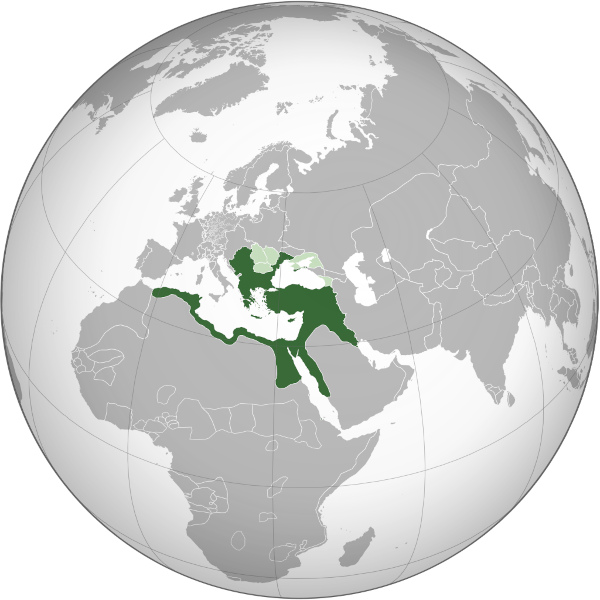

# Império Otomano

## Resumo sobre Império Otomano

1. O Império Otomano foi um vasto e poderoso império que abrangeu partes da Europa, da Ásia e da África.
2. Existiu entre o final do século XIII e o início do século XX, durando mais de 600 anos.
3. Osman I foi o fundador do império, e a palavra “otomano” deriva do seu nome.
4. O império surgiu das pequenas tribos turcomanas na Anatólia.
5. Seu auge ocorreu durante os séculos XVI e XVII.
6. Vários países modernos, como Bulgária, Sérvia, Turquia, Síria, Egito, Líbia e partes da Grécia, fizeram parte do império durante o seu auge.
7. A economia otomana era baseada na agricultura, no comércio e em tributações.
8. O islã era a religião oficial do império.
9. A sociedade otomana era composta por várias etnias e religiões, mas havia uma distinção clara entre muçulmanos e não muçulmanos.
10. O Império Otomano era uma monarquia absoluta.
11. A cultura otomana era uma fusão de elementos turcos, persas, árabes e bizantinos.
12. O declínio do império deu-se por perda de territórios, corrupção, má administração, pressão de potências europeias e movimentos nacionalistas internos.
13. O império acabou após a Primeira Guerra Mundial.
14. Em 1923, a República da Turquia foi proclamada, marcando o término do domínio imperial na região."

## O que foi o Império Otomano?

O Império Otomano foi um dos maiores e mais duradouros impérios da história mundial, existindo entre o final do século XIII e o início do século XX. Ele se destacou por sua vasta extensão territorial, abrangendo partes da Europa, Ásia e África, e por sua influência significativa na política, economia, cultura e sociedade global durante mais de 600 anos.

O Império Otomano foi fundado pelos turcos otomanos e se expandiu rapidamente sob uma série de sultões dinâmicos e competentes. A capital do império, Constantinopla (atual Istambul), tornou-se um centro cultural e econômico vital. O império foi um ponto de encontro de diversas culturas, religiões e etnias, o que contribuiu para a sua riqueza e complexidade. Sua queda, em 1922, marcou o fim do domínio imperial na região e o surgimento da moderna República da Turquia."

## Contexto histórico do Império Otomano

### O que significa o termo “otomano”?

O termo “otomano” deriva do nome Osman I, o fundador do império. Em árabe, ele é chamado de Uthman, e seus seguidores ficaram conhecidos como Osmânlılar, em turco, que se translitera para “otomanos”, em português. Osman I era um líder tribal turco que, no final do século XIII, estabeleceu um pequeno principado na Anatólia Ocidental, região que se tornaria o núcleo do futuro império.

### Origem do Império Otomano

O Império Otomano teve suas origens nas pequenas tribos turcomanas que habitavam a Anatólia. No final do século XIII, sob a liderança de Osman I, essas tribos começaram a se expandir e a consolidar seu poder. A localização estratégica da Anatólia, entre a Europa e a Ásia, facilitou a expansão territorial e a integração de diversas culturas e povos.

A conquista de Constantinopla, em 1453, por Mehmed II, foi um marco significativo que estabeleceu o Império Otomano como uma potência dominante na região."

## Quais países faziam parte do Império Otomano?

O Império Otomano, em seu auge, abrangia territórios que hoje correspondem a vários países modernos.

Na Europa:

Bulgária;
Macedônia;
Sérvia;
Bósnia e Herzegovina;
Albânia;
Montenegro;
Romênia;
Hungria;
partes da Grécia.

Na Ásia:

Turquia;
Síria;
Líbano;
Israel;
Palestina;
Jordânia;
Iraque;
Kuwait;
Arábia Saudita;
Iêmen;
Omã;
partes dos Emirados Árabes Unidos.

Na África:

Egito;
Líbia;
Tunísia;
Argélia;
Sudão.

## Batalhas do Império Otomano

O Império Otomano esteve envolvido em inúmeras batalhas e guerras durante sua existência, tanto em sua expansão quanto na defesa de seus territórios. Algumas das batalhas mais notáveis foram:

- Batalha de Nicópolis (1396): uma vitória significativa sobre uma coalizão europeia que consolidou o controle otomano sobre os Bálcãs.
- Conquista de Constantinopla (1453): uma das vitórias mais importantes, liderada por Mehmed II, que marcou o fim do Império Bizantino e a transformação de Constantinopla na capital otomana.
- Batalha de Chaldiran (1514): uma vitória crucial sobre o Império Safávida, que garantiu o controle otomano sobre a Anatólia Oriental.
- Cerco de Viena (1529): uma tentativa fracassada de capturar Viena que marcou o limite da expansão otomana na Europa Central.
- Batalha de Lepanto (1571): uma derrota naval significativa contra uma coalizão cristã que, no entanto, não resultou em perda substancial de territórios.
- Batalha de Viena (1683): outra tentativa fracassada de capturar Viena, marcou o início do declínio territorial otomano.

## Como foi o declínio do Império Otomano

O declínio do Império Otomano foi um processo gradual que se estendeu por vários séculos. Diversos fatores contribuíram para esse declínio. Ao longo dos séculos XVII e XVIII, o império começou a perder territórios para potências europeias emergentes, como a Áustria, a Rússia e a França.

Problemas como corrupção, má administração e falta de reformas significativas enfraqueceram a estrutura interna do império. Movimentos nacionalistas nas províncias balcânicas e árabes enfraqueceram o controle central. Guerras frequentes com a Rússia, a Áustria e outras potências europeias exauriram os recursos otomanos.

Outro fator importante foi a incapacidade de modernizar as forças armadas e a administração pública, o que deixou o império em desvantagem frente às potências europeias industrializadas.

## Fim do Império Otomano

O fim do Império Otomano foi formalmente selado após a Primeira Guerra Mundial. O império entrou na guerra ao lado das Potências Centrais (Alemanha e Áustria-Hungria), e sua derrota resultou na ocupação de grande parte de seu território pelos Aliados. O Tratado de Sèvres, assinado em 1920, desmantelou oficialmente o império, dividindo seus territórios entre as potências vencedoras.

A resistência turca, liderada por Mustafa Kemal Atatürk, resultou na Guerra de Independência Turca e na abolição do sultanato, em 1922. No ano seguinte, a República da Turquia foi proclamada, marcando o fim definitivo do Império Otomano e o início de uma nova era na região.
