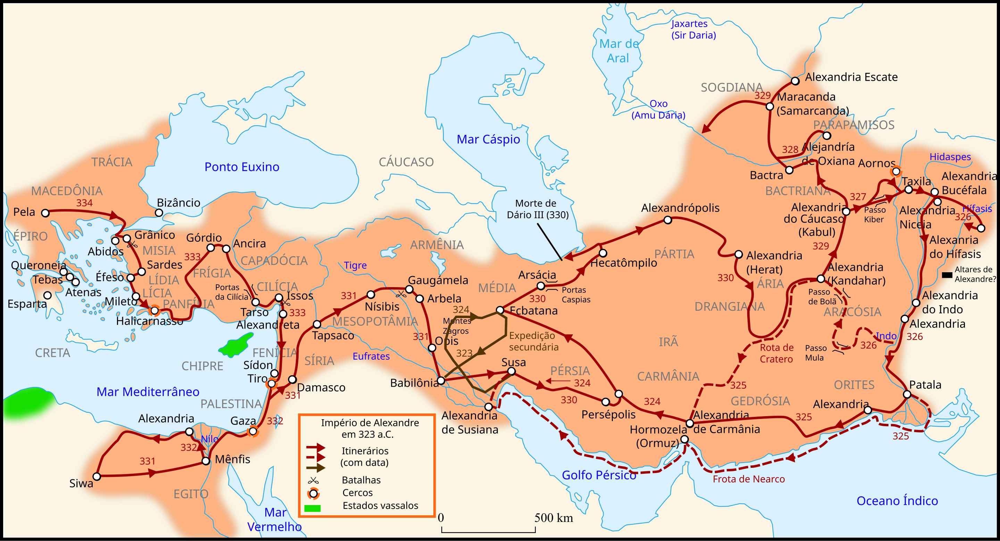

# Alexandre, o Grande

(356 aC-323 aC)

Alexandre, o Grande, é famoso por ser um dos maiores generais militares que o mundo já viu. Ele era o filho de Filipe II, o rei da Macedônia. Ele cresceu observando o governo de seu pai e viu Philip desenvolver a Macedônia em uma grande potência militar. Foi dito que ele era extremamente corajoso desde muito jovem; corajoso o suficiente para domar um garanhão selvagem e barulhento com a tenra idade de 12 anos.

Sendo um príncipe, Alexandre teve a sorte de receber sua educação do renomado filósofo grego Aristóteles. Este filósofo plantou a semente da curiosidade, e daí o amor de Alexandre pelo conhecimento cresceu. Ele não era apenas um grande gênio militar, mas excepcional nos campos da ciência, literatura, filosofia e medicina.

O pai de Alexandre foi assassinado quando tinha 20 anos e, nessa idade, subiu ao trono, prometendo seguir os passos de seu pai. Sendo filho de um grande conquistador, Alexandre continuou o legado deixado por seu pai ao conquistar o Império Persa. Nesse ponto, seu império se estendia do mar Adriático ao rio Indo.

Buscando alcançar os "confins do mundo e do Grande Mar Exterior", invadiu a Índia em 326 a.C., mas foi forçado a voltar pela demanda de suas tropas. Alexandre morreu na Babilônia em 323 a.C., a cidade que planejava estabelecer como sua capital, sem executar uma série de campanhas planejadas que teria começado com uma invasão da Arábia.

¸
