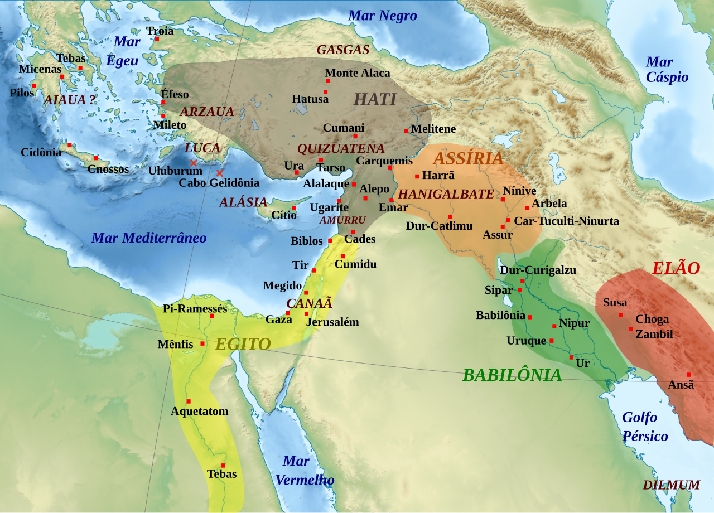

# Assíria

- 2 500 a.C. — 612 a.C
- Os descendentes dos assírios ainda habitam a região nos dias de hoje, formando uma minoria cristã no Iraque
- Os assírios são considerados como o primeiro povo a ter um exército organizado e hierarquizado. Foi através da violência que impunham as regras assírias sobre os conquistados e cobravam os impostos. 

## Resumo

A Assíria, também chamada Império Assírio, foi um reino [mesopotâmico](mesopotamia) e um império do Antigo Oriente Próximo e do Levante. Existiu como um Estado talvez desde o século XXV a.C. (na forma da cidade-Estado de Assur) até seu colapso entre 612 e 609 a.C. — abrangendo os períodos do início ao meio da Idade do Bronze até o final da Idade do Ferro. Desde o final do século VII a.C. (quando o Império Neoassírio caiu) até meados do século VII, ele sobreviveu como uma entidade geopolítica, em sua maioria governada por potências estrangeiras, como o Império Parta e o Império Sassânida entre meados do século II a.C. e final do século III d.C., a parte final do período em que a Mesopotâmia se tornou um importante centro do cristianismo sírio e o local de nascimento da Igreja do Oriente.

Um território amplamente falante de semítico, a Assíria estava centralizada no Tigre, na Alta Mesopotâmia (no norte do que é hoje o Iraque, o nordeste da Síria, o sudeste da Turquia e o noroeste do Irã). Os assírios chegaram a governar impérios poderosos em vários períodos. Fazendo parte substancial do "berço da civilização" da Mesopotâmia, que incluía a Suméria, o Império Acádio e a Babilônia, a Assíria alcançou o auge das realizações tecnológicas, científicas e culturais de sua época. Em seu auge, o Império Neoassírio (911–609 a.C.) se estendia do Chipre e do Mediterrâneo Oriental até o Irã e da atual Armênia e Azerbaijão, no Cáucaso, até a Península Arábica, Egito e Líbia oriental.

O nome "Assíria" tem origem na capital original do estado assírio, a antiga cidade de Assur, que data de c. 2 600 a.C. — originalmente uma das várias cidades-Estados de língua acádia na Mesopotâmia. Nos séculos XXV e XXIV a.C., os reis assírios foram líderes pastorais. A partir do final do século XXIV a.C., os assírios ficaram sujeitos ao governo do Sargão da Acádia, que uniu todos os povos da Mesopotâmia, de língua acádia e suméria, sob domínio do Império Acádio, que durou de c. 2 334 a 2 154 a.C. Depois que o Império Assírio entrou em colapso, a maior parte remanescente da Assíria formou uma região geopolítica e uma província de outros impérios, embora entre meados do século II a.C. e o final do século III d.C. surgisse uma colcha de retalhos de pequenos reinos assírios independentes na forma de Assur, Adiabena, Osroena, Bete Nuadra, Bete Garmai e Hatra.

A região da Assíria caiu sob o controle sucessivo do Império Medo (678–550 a.C.), o Império Neobabilônico (626–539 a.C.), o Império Aquemênida (550–330 a.C.), o Império Macedônio (final do século IV a.C.), o Império Selêucida (312–63 a.C.), o Império Parta (247 a.C.–224 d.C.), o [Império Romano](imperioromano) (de 116 a 118) e o Império Sassânida (224–651). A conquista [islâmica](islam) árabe da área em meados do século VII finalmente dissolveu a Assíria (Assuristão) como uma entidade única, após a qual os remanescentes do povo assírio (agora cristãos) gradualmente se tornaram uma minoria étnica, linguística, cultural e religiosa em sua região nativa.

