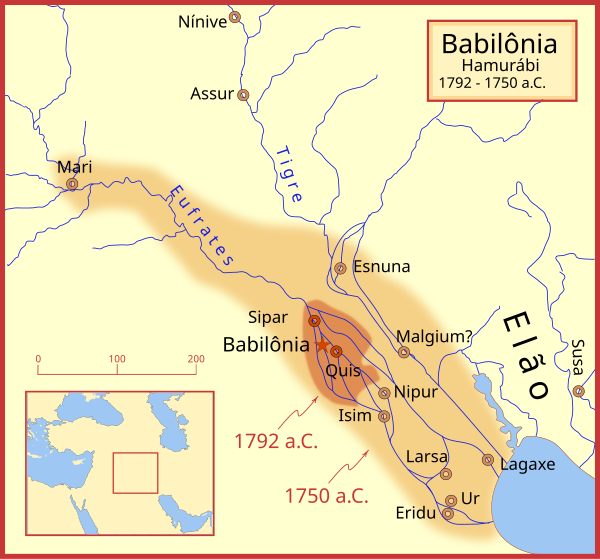

# Babilônia

De 1 894 — 538 a.C, quando foi invadida pelos [persas](persia)

## Resumo

Babilônia foi uma antiga área cultural e estatal de língua acadiana, localizada na região centro-sul da Mesopotâmia (atual Iraque). Um pequeno Estado governado pelos amorreus surgiu em 1 894 a.C., que continha a pequena cidade administrativa da Babilônia.[1] Foi apenas uma pequena cidade provinciana durante o Império Acadiano (r. 2335–2154 a.C.), mas expandiu-se bastante durante o reinado de Hamurabi na primeira metade do século XVIII a.C. e tornou-se uma grande capital, período no qual foi chamada de "o país de Acádia" (Māt Akkadī em acadiano), um arcaísmo deliberado em referência à glória anterior do Império Acadiano.

Costumava envolver-se em rivalidade com o Estado mais antigo da Assíria, ao norte, e Elam, a leste, no antigo Irã. A Babilônia tornou-se brevemente a principal potência na região depois que Hamurabi criou um império de curta duração, sucedendo o Império Acadiano anterior, a Terceira Dinastia de Ur e o Império Assírio Antigo. O Império Babilônico, no entanto, rapidamente desmoronou após a morte de Hamurabi e reverteu a um pequeno reino.

## Reino de Hamurabi

A Babilônia permaneceu como uma cidade menor em um pequeno Estado até o reinado de seu sexto governante amorreu, Hamurabi (r. 1792–1750 a.C.). Ele conduziu grandes obras na Babilônia, expandindo-a de uma cidade pequena para uma grande cidade digna do reinado. Um governante muito eficiente, ele estabeleceu uma burocracia, com tributação e governo centralizado. Hamurabi libertou Babilônia do domínio elamita e, na verdade, expulsou inteiramente os elamitas do sul da Mesopotâmia. Ele então sistematicamente conquistou o sul da região, incluindo as cidades de Isin, Larsa, Esnuna, Quis, Lagas, Nipur, Borsipa, Ur, Uruque, Uma, Adabe, Sipar, Rapicum e Eridu. Suas conquistas deram estabilidade à região após tempos turbulentos e uniu a colcha de retalhos de pequenos Estados em uma única nação; é somente a partir da época de Hamurabi que o sul da Mesopotâmia adquiriu o nome de "Babilônia".

Hamurabi virou seus exércitos disciplinados para o leste e invadiu a região que mil anos depois se tornou o Irã, conquistando elamitas, gútios, lulubis e cassitas. No oeste, ele conquistou os Estados amorreus do Levante (moderna Síria e Jordânia), incluindo os poderosos reinos de Mari e Iamade. Hamurabi então entrou em uma guerra prolongada com o Império Assírio Antigo pelo controle da Mesopotâmia e o domínio do Oriente Próximo. A Assíria ampliara o controle sobre grande parte das regiões dos hurritas e hatitas, no sudeste da Anatólia, a partir do século XXI a.C.. No final do século XX a.C. afirmava-se sobre o nordeste do Levante e o centro da Mesopotâmia. Depois de uma luta prolongada ao longo de décadas com os poderosos reis assírios Samsiadade I e Ismedagã I, Hamurabi forçou seu sucessor Mutassur a prestar tributo à Babilônia c. 1 751 a.C., dando à Babilônia o controle sobre as colônias seculares da Assíria, hurritas e hatitas, na Anatólia.

 Após a morte de Hamurabi, seu império começou a se desintegrar rapidamente.

## Domínio aquemênida e queda

- A Babilônia foi absorvida pelo [Império Aquemênida](persia) em 539 a.C.

- [Alexandre, o Grande](alexandre_o_grande), conquistou a Babilônia em 333 a.C. para os [gregos](grecia)
