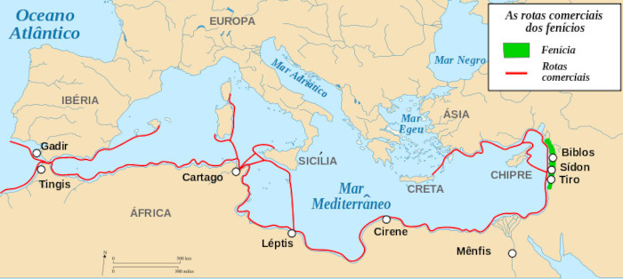

# Fenicia

- 1200 a.C.-539 a.C.
- Criaram o primeiro alfabeto fonético, que se tornou a base para muitos outros alfabetos, incluindo o grego e, eventualmente, o latino

## Resumo

Os fenícios foram um povo semita com raízes em Canaã que habitou uma estreita faixa de terra ao longo da costa sírio-libanesa, entre as atuais regiões do Líbano, Síria e norte de Israel e o Mar Mediterrâneo. Eram conhecidos por seu próspero comércio marítimo, sociedade de cidades-estados autônomas, religião politeísta e influência cultural por meio do alfabeto.

Sua influência estendeu-se por todo o Mediterrâneo, facilitando o comércio e a interação cultural entre civilizações. Tiveram relações turbulentas com os gregos, por disputas pelas áreas colonizadas, e romanos, durante as Guerras Púnicas. A queda de sua civilização relacionou-se a fatores como as Guerras Púnicas, pressões externas e disputas internas.

- A relação entre fenícios e [gregos](grecia) foi caracterizada por uma competição ativa na colonização do Mediterrâneo, com ambos os povos buscando expandir seus territórios.

- A relação dos fenícios com os [romanos](imperioromano), por outro lado, envolveu eventos notáveis, como as [Guerras Púnicas(cartago)], que tiveram um impacto duradouro na região do Mediterrâneo, especialmente na ascensão de Roma como uma potência regional.
    - Os fenícios tiveram um papel fundamental na fundação de [Cartago](cartago). Por volta de 814 a.C., os fenícios, conhecidos por suas habilidades marítimas e comerciais, estabeleceram Cartago como uma colônia no norte da África12. Com o tempo, Cartago cresceu e se tornou uma potência comercial e militar independente, rivalizando com outras grandes civilizações da época, incluindo Roma3

## Apogeu: 1200–800 a.C.

O historiador francês Fernand Braudel comentou em seu livro, A Perspectiva do Mundo, que a Fenícia foi um dos primeiros exemplos de uma "economia-mundial" cercada por impérios. O ponto alto da cultura fenícia e de seu poder marítimo costuma ser datado como o período que vai de 1 200 a 800 a.C.

## Declínio: 539−65 a.C.

Ciro, o Grande, rei da [Pérsia](persia), conquistou a Fenícia em 539 a.C. 
