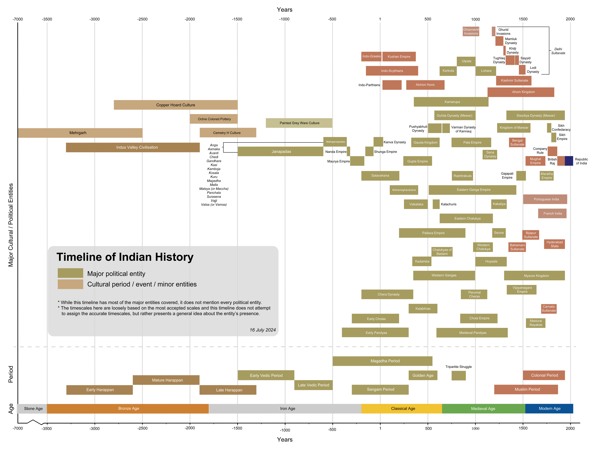

# India

Anatomically modern humans first arrived on the Indian subcontinent between 73,000 and 55,000 years ago. The earliest known human remains in South Asia date to 30,000 years ago. Sedentariness began in South Asia around 7000 BCE; by 4500 BCE, settled life had spread, and gradually evolved into the Indus Valley Civilisation, one of three early cradles of civilisation in the Old World, flourished between 2500 BCE and 1900 BCE in present-day Pakistan and north-western India. Early in the second millennium BCE, persistent drought caused the population of the Indus Valley to scatter from large urban centres to villages. Indo-Aryan tribes moved into the Punjab from Central Asia in several waves of migration. The Vedic Period of the Vedic people in northern India (1500–500 BCE) was marked by the composition of their extensive collections of hymns (Vedas). The social structure was loosely stratified via the varna system, incorporated into the highly evolved present-day Jāti system. The pastoral and nomadic Indo-Aryans spread from the Punjab into the Gangetic plain. Around 600 BCE, a new, interregional culture arose; then, small chieftaincies (janapadas) were consolidated into larger states (mahajanapadas). Second urbanization took place, which came with the rise of new ascetic movements and religious concepts, including the rise of Jainism and Buddhism. The latter was synthesized with the preexisting religious cultures of the subcontinent, giving rise to Hinduism.

Chandragupta Maurya overthrew the Nanda Empire and established the first great empire in ancient India, the Maurya Empire. India's Mauryan king Ashoka is widely recognised for his historical acceptance of Buddhism and his attempts to spread nonviolence and peace across his empire. The Maurya Empire would collapse in 185 BCE, on the assassination of the then-emperor Brihadratha by his general Pushyamitra Shunga. Shunga would form the Shunga Empire in the north and north-east of the subcontinent, while the Greco-Bactrian Kingdom would claim the north-west and found the Indo-Greek Kingdom. Various parts of India were ruled by numerous dynasties, including the Gupta Empire, in the 4th to 6th centuries CE. This period, witnessing a Hindu religious and intellectual resurgence is known as the Classical or Golden Age of India. Aspects of Indian civilisation, administration, culture, and religion spread to much of Asia, which led to the establishment of Indianised kingdoms in the region, forming Greater India. The most significant event between the 7th and 11th centuries was the Tripartite struggle centred on Kannauj. Southern India saw the rise of multiple imperial powers from the middle of the fifth century. The Chola dynasty conquered southern India in the 11th century. In the early medieval period, Indian mathematics, including Hindu numerals, influenced the development of mathematics and astronomy in the Arab world, including the creation of the Hindu-Arabic numeral system.

Islamic conquests made limited inroads into modern Afghanistan and Sindh as early as the 8th century, followed by the invasions of Mahmud Ghazni. The Delhi Sultanate was founded in 1206 by Central Asian Turks who were Indianized. They ruled a major part of the northern Indian subcontinent in the early 14th century. It was ruled by multiple Turk, Afghan and Indian dynasties, including the Turco-Mongol Indianized Tughlaq Dynasty but declined in the late 14th century following the invasions of Timur and saw the advent of the Malwa, Gujarat, and Bahmani Sultanates, the last of which split in 1518 into the five Deccan sultanates. The wealthy Bengal Sultanate also emerged as a major power, lasting over three centuries. During this period, multiple strong Hindu kingdoms, notably the Vijayanagara Empire and the Rajput states, emerged and played significant roles in shaping the cultural and political landscape of India.

The early modern period began in the 16th century, when the Mughal Empire conquered most of the Indian subcontinent, signaling the proto-industrialisation, becoming the biggest global economy and manufacturing power. The Mughals suffered a gradual decline in the early 18th century, largely due to the rising power of the Marathas, who took control of extensive regions of the Indian subcontinent. The East India Company, acting as a sovereign force on behalf of the British government, gradually acquired control of huge areas of India between the middle of the 18th and the middle of the 19th centuries. Policies of company rule in India led to the Indian Rebellion of 1857. India was afterwards ruled directly by the British Crown, in the British Raj. After World War I, a nationwide struggle for independence was launched by the Indian National Congress, led by Mahatma Gandhi. Later, the All-India Muslim League would advocate for a separate Muslim-majority nation state. The British Indian Empire was partitioned in August 1947 into the Dominion of India and Dominion of Pakistan, each gaining its independence.

