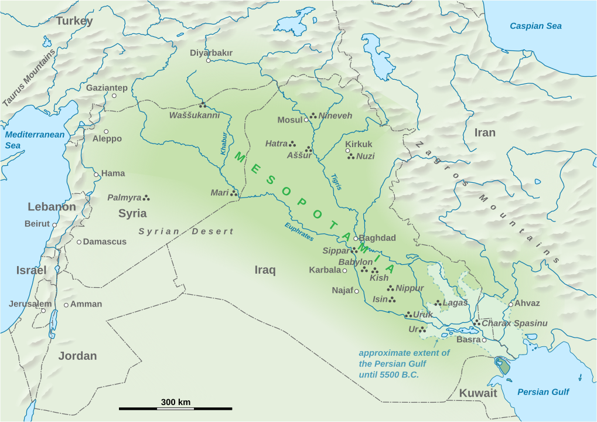

# Mesopotamia

Mesopotamia is a historical region of West Asia situated within the Tigris–Euphrates river system, in the northern part of the Fertile Crescent. Today, Mesopotamia is known as present-day Iraq. In the broader sense, the historical region of Mesopotamia also includes parts of present-day Iran, Turkey, Syria and Kuwait.

Mesopotamia is the site of the earliest developments of the Neolithic Revolution from around 10,000 BC. It has been identified as having "inspired some of the most important developments in human history, including the invention of the wheel, the planting of the first cereal crops, the development of cursive script, mathematics, astronomy, and agriculture". It is recognised as the cradle of some of the world's earliest civilizations.

The [Sumerians](sumeria) and Akkadians, each originating from different areas, dominated Mesopotamia from the beginning of recorded history (c. 3100 BC) to the fall of Babylon in 539 BC. The rise of empires, beginning with Sargon of Akkad around 2350 BC, characterized the subsequent 2,000 years of Mesopotamian history, marked by the succession of kingdoms and empires such as the Akkadian Empire. The early second millennium BC saw the polarization of Mesopotamian society into Assyria in the north and Babylonia in the south. From 900 to 612 BC, the Neo-Assyrian Empire asserted control over much of the ancient Near East. Subsequently, the Babylonians, who had long been overshadowed by Assyria, seized power, dominating the region for a century as the final independent Mesopotamian realm until the modern era. In 539 BC, Mesopotamia was conquered by the [Achaemenid Empire](persia). The area was next conquered by [Alexander the Great](alexandre_o_grande) in 332 BC. After his death, it became part of the Greek Seleucid Empire.

