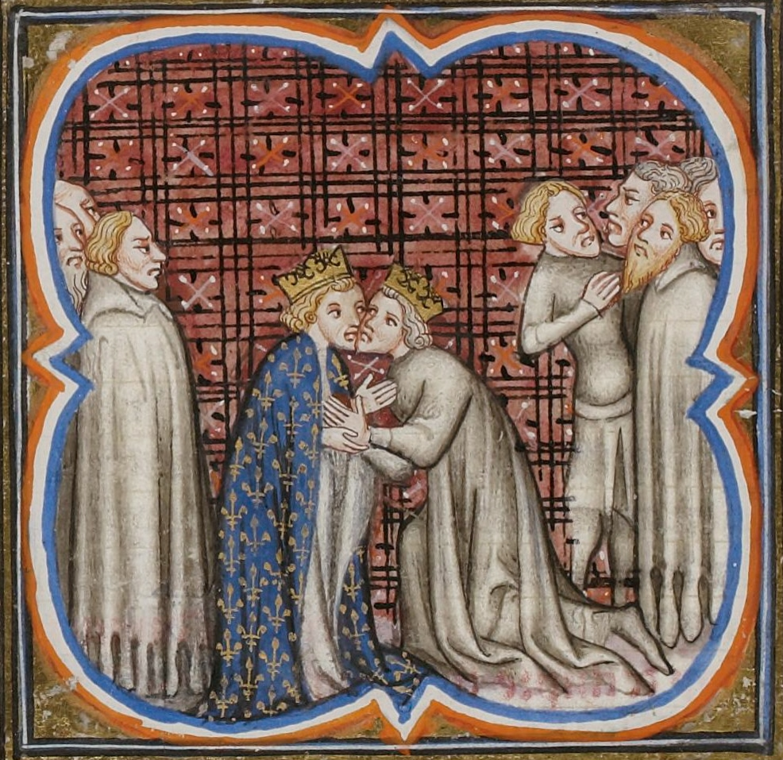
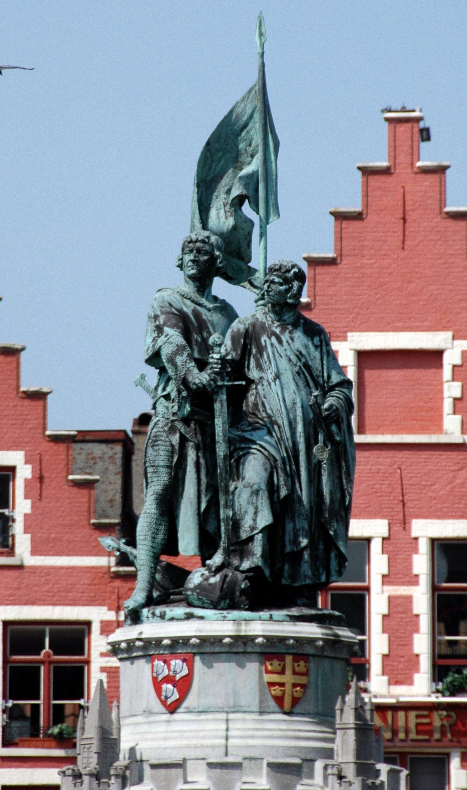

# The Battle of the Golden Spurs Set Flanders Free

By the late 1200s, many of the social trends and forces, such as feudalism, urbanisation and industrialisation, came to a boiling point in Flanders. The political relations between the Counts of Flanders and their liege lord, the king of France, became further complicated by Flanders’ dependence on English wool. That wool upheld the strength and influence of the major urban centres, particularly the so-called “Big 5” – Bruges, Ghent, Ypres, St Omer and Kortrijk. Towns, within their walls, were governed by an urban patriciate who were not of the nobility, but who were wealthy and influential enough to contend with the nobility and the counts of Flanders. The urban patriciate, however, did not sit comfortably in power themselves. Craft guilds had developed to foster bodies of workers who did not have governmental representation in towns, but who could bring pressure on the functioning of the industry through actions such as strikes and riots.

|  |
| *Guy of Dampierre, Count of Flanders. His surcoat bears the arms of the county of Flanders. He was a prisoner of the French when his Flemings defeated the latter at the Battle of the Golden Spurs in 1302* |

In the late 1200s the Count of Flanders was a guy called…uh…Guy. Guy of Dampierre. He took over from his mother who had gotten herself entangled in a bit of animosity with the King of England, Edward I. Edward had wreaked his revenge through restrictions on the wool trade, and which led the towns of Flanders to suffer. The urban patriciate, therefore, was not particularly enamoured with the Dampierre lords.

In 1285 a 17-year-old was crowned King Philip IV of France, also known as Philip the Fair. He had ambitions extending beyond his inherited domains, and particularly as regarded his realm’s relationships with England and Flanders. In 1294 war broke out between France and England over the areas of Gascon and Aquitane, way down in the southeast of what is today France. At this point, they were territories controlled by the English King Edward I. Flanders, with all the aforementioned issues bearing down upon it, and stuck as it was between the two great powers, would not escape any of this unscathed.

|  |
| *Edward I (right) giving homage to Philip IV of France (left). As Duke of Aquitaine, Edward was a vassal of the French king* |

By this time, Guy of Dampierre had forged a more amicable relationship with the English king than his mother had done, but this had greatly displeased his actual liege lord, the young King Philip IV of France. In 1294, he arranged a marriage alliance between himself and the English royal family, by affiancing one of his many daughters to the Prince of Wales. For doing this, he and two of his sons were imprisoned by the French king until he renounced the marriage. His daughter was also imprisoned, but was not released, and would remain imprisoned for the remainder of her life. Lucky her.

Philip then tightened his grasp over Flanders. He ruled that only French coin could be used in Flanders, and that Guy must devalue other currencies from England and the Holy Roman Empire. Then, he confiscated all precious metals, redeemable only by French coin, and in 1295 put an embargo on English goods. Philip was a clever politician, and he understood that his strongest move against the Flemish count was to hit him in the wooly bits. He gave Flemish cloth a monopoly in French markets, but he also gave Guy the benefits of the trade embargo on England: whatever was confiscated from English ships, Guy could keep. As you can imagine, this made Guy pretty unpopular with the town’s people whose livelihoods depended on the wool trade with England.

The tensions between Flanders and France only continued, and got worse in the beginning of 1296 when Guy of Dampierre tried to annex the city of Valenciennes to Flanders from the French-allied family of his half-siblings, the Avesnes who ruled Hainault. In response, Philip IV ordered Guy to Paris where, in front of representatives of the five big cities of Flanders, he had his territory officially stripped away from him, but then returned in exchange for a huge fine. Guy also agreed not to retaliate against the Flemish towns which had chosen to align themselves directly with the French King, thus bypassing his authority as count.

>In early 1297 the Count of Flanders renounced his loyalty to the French, and sought an official alliance with the English

All of this pushed Guy gradually into a corner, and in early 1297 he renounced his loyalty to the French altogether, and sought an official alliance with the English. The response was brutal. Philip declared Flanders annexed to France. Guy tried his best to keep the cities under his control, dissolving the town council of Ghent and replacing it with allies of his own. In June of 1297, Philip then sent his army of knights, town infantry and mercenaries to bring Flanders to heel. Guy raised his banners. Around 43 bannerlords, leading units of around 20 nobles, were joined by around 2000 common foot soldiers, and in August they all marched off to meet the French at Bulskamp. The Flemish army was absolutely destroyed.

>The French kept rampaging through Flanders, taking towns and cities

A little over a week after this heavy defeat, the English king Edward I landed in Flanders in the town of Sluis at the head of an expeditionary force, with the intent of giving assistance to the Flemish against the French. He marched towards Ghent, where Guy was holed up in the Castle of the Counts. The French kept rampaging through Flanders, taking towns and cities, and in September 1297, the alderman of Bruges aligned themselves with France.

By the end of that year, a three year truce was agreed between the French and Flanders. During this detente, Philip IV used many of his wily tricks to undermine the military strength of Guy. He bought off his knights and other nobles, promising them much reward for switching their allegiance to France. He then secretly conducted a separate peace with Edward, who according to the terms of the peace, took his expeditionary force and set off to go and kill some Scots, as English kings have traditionally been want to do.

The Franco-Flemish truce concluded in 1300 and immediately the French invaded Flanders again. Guy was now abandoned by the English, as well as many of his lords and knights. Left with barely 100 loyal banner men, he was unable to defend against the invading armies. He surrendered and, along with his son and about three dozen family members, they went to go and plead their case in Paris. They were all thrown in prison. Flanders was now officially a part of France. Phillip IV appointed a French knight called Jacques de Chatillôn as his governor in charge of a full on military occupation.

## Leliaards & Liebaards

Generally speaking, by the 1300s two factions had emerged within Flemish towns as a consequence of the previous decades of economic pressure and the French occupation. Leliaards were those in favour of continued loyalty to the French king, their name originating from the lilies on the coat of arms of the monarch. Liebaarts were pro-Flemish independence, their name coming from the lion/leopard of Flanders; black on a yellow shield.

For a long time historians painted the Liebaard versus Leliaard conflict as a class war. From this perspective, Liebaarts were workers and Leliaards patricians, However, more recent understandings are that it is way more complicated than that, as history always is. Basically there were many different layers to these urban societies in the lowlands. Groups and individuals – from craft guilds, to non-patriciate nouveau riche, to foreign and local merchants, to governing patricians, to workers in different towns – would have just jostled around within and between the factions according to their own collective and/or individual interests.

Within each town the factions would have differed from their counterparts in other towns. In Bruges the Liebaarts leadership came from a weaver and a butcher, called Pieter de Coninck and Jan Breydel. They formed a nucleus from which the greatest push for Flemish liberty derived. In Ghent, however, the Liebaarts were quelled and the Leliaards chastened. The town would remain neutral throughout the coming conflict. Kortrijk was completely occupied by the French.

## The Bruges Matins

Liebaart leaders, like Pieter de Conick and Jan Breydel, were expelled from Bruges in an attempt to appease the French occupiers. They would return the next night, on 18 May, joined not only by their supporters, but also by many others. Anti-French sentiment had gone from a spark to a bonfire overnight. Mob violence erupted, with many workers and anti-French sympathisers massacring anyone in Bruges supporting the French tyranny.

|  |
| *DStatue of Liebaart leaders Jan Breydel and Pieter de Coninck in Bruges* |

Some French speakers tried to hide, or denied their francophilia. The rioters therefore demanded that they pronounce a Dutch phrase: Schild en Vriend (Shield and friend). If mispronounced, the mob showed no mercy. But it’s not just the French in town that had reason to fear. Some of the patriciate, members of the landowning elite who govern the town, were in alliance with the French, given that they saw more economic stability there than with the Flemish count.

Sources vary on the number of casualties during the Bruges Matins, ranging from 200 to 2000 dead. Anyone who spoke French, and anyone who supported the French, was in grave danger that early morning. Once it was done, the canals of Bruges were littered with soon to be bloated bodies, and blood stained the streets and the walls. It was a brutal massacre, and it would reverberate throughout the history of the low countries.

|  |
| *The Bruges Matins of 18 May 1302, as depicted in a miniature from the Grandes Chroniques de France* |

Workers had now jumped headfirst into the whole, great hotbed of geopolitical, economic and social upheaval that had been developing between the heavyweights of France, Flanders and England, and amidst the scheming and plotting of other nobles and the urban ruling patriciate. They had shown that they were willing to kill for their own rights within it all. De Chatillôn only managed to escape the violence by dressing up as a commoner.

## Knights, militias and medieval armies

Being a knight was expensive. First of all you needed a war horse, preferably a really big and powerful one, like a destrier. These massive animals were decked out with armour plating which could weigh up to 40kg, and would sometimes have spikes sticking out of it with which to annihilate any enemies they trampled over. But those horses were cumbersome to ride, so when travelling around from place to place, knights would also need at least one other smaller, more comfortable horse. Add to that your armour, your chain mail, your helmet, your sword, your lance, your spurs, and you’re looking at a very costly exercise. But, it doesn’t end there. Getting into all of that armour takes ages, and requires help. “Go find the breastplate stretcher, now!” You would also need to lug all that equipment around, so you would have several servants to help with all of that. But of course then you also had to supply those servants with tents, food, and all the other living essentials, as well as your banners with which to show off from which house you came and to whom you owed your allegiance. So to be a knight, you needed money.

|  |
| *Duel between the Dukes of Bretagne and Bourbon (with the lilies) during a tournament* |

As this was a violent era, there was a very high chance that your life would end at the point of a sword, so you also needed to be skilled in battle if you were going to survive long enough to try and move up the feudal ladder. On top of regular training, knights would take part in tournaments. Tournaments would be grand affairs that would be hosted by lords in the grounds outside of castles. Here, knights were invited to take part in war games in which they could demonstrate their military prowess, often through a melee, or by jousting. A melee would either consist of two teams of horsemen clashing into each other and trying to break each other’s ranks, or an all-in battle royale in which knights would fight either on foot or on horseback. The aim would be to defeat your opponent and hold them for ransom, a nice way to make back some of the many costs which being a knight incurred. Jousting saw two knights on horseback charging at each other with their lances levelled, trying to smash the opponent off their horse. At the end of the tournament, huge feasts would be held and prizes would be awarded to the bravest and best fighters.

The French word for a knight is chevalier, and it is from this that the word chivalry derives. The idea of chivalry developed around the 11-1200s, often encouraged by the Church, to try and moderate military bloodlust and promote some kind of ethics within warfare. So knights would be bound by oath to honour their overlord, and were encouraged to take prisoners rather than kill unarmed opponents. We’ve already mentioned an early example of this in Episode 6, the Peace and Truce of God, which tried to limit the abuses knights would inflict on commoners. It was for chivalric reasons that knights would try to not kill each other, not only in tournaments, but also in battle. If an opposing army was routed, knights would often prefer to capture their opponents and hold them for ransom, rather than finish each other off. This, along with many other aspects of feudal society, helped to develop a kind of knightly arrogance, in which they would see each other as “above” the commoners. Commoners could be ridden down with no issue, but other knights? No, they were like you, and they deserved honour and mercy.

>Knights would be bound by oath to honour their overlord, and were encouraged to take prisoners rather than kill unarmed opponents

Since it cost so much money to be a knight, many people chose not to take on the prestige of the title, and would instead fight as mercenary armoured cavalry. These would be often be people who, although they didn’t have the funds required to be a knight, could still fight and would be available for hire to bolster medieval armies. Also available for hire would be mercenary pikemen, foot soldiers, archers and crossbowmen.

Finally, and especially in Flanders and the low countries, armies would be supplemented by the civic militias of the towns. Each town would have its own militias, which they would use to patrol their walls and keep guard over the cities to ensure security. Any man living in a town could be called up to take part in the militia and, although the militias would maintain arsenals of weapons, most people would have kept their own weapons and armour at home. Each guild in a town would be required to give a certain number of their members to town militias, depending on the size of the guild. The biggest caveat with the town militias was that they were not allowed to fight in wars outside of the count’s own territory without the explicit permission of the town councils. Flemish armies were used in all sorts of different theaters of war over the 1200s, particularly as mercenaries in wars in England, but also in campaigns fought by Flanders in Holland and Hainault.

## The Goedendag

The popular ‘every-man’ weapon in Flanders at the time was called a goedendag. It is uncertain where this name originally comes from, but it handily translates into English as ‘Good Day’.

Imagine these metal monstrosities connected to a long, wooden staff. Although many soldiers had pikes, swords and axes, the goedendag
has gone down in history as the weapon which the commoners of Bruges managed to defy a French cavalry charge.

|  |
| *The metal tip of a 'goedendag'* |

The Battle of the Golden Spurs
Following the Matins of Bruges on 18 May 1302, a line had been drawn in the boggy Flemish mud. The pressure-building years of to-ing and fro-ing between the various agendas of all interested parties had come to a boiling point. For people in Flanders who were pro-Flemish independence, a statement had been made and very quickly almost all of the towns, Ghent being the major exception, joined in the rebellion.

People of all classes had no choice but to join in, because of how serious the situation had become. There was no way Philip IV of France was going to hear about the massacre in Bruges and the riled up Flemish towns, sit back, and ponderously consider giving concessions to anyone. Instead, he was going to do what he had consistently done for years, and send his forces in to, once again, bring the Flemish to heel.

To quote historian Randall Fegley, all throughout Flanders:

>…merchants left their stores, peasants deserted their fields, and monks abandoned their cubicles. Pooling their war chests, the guilds were able to hire some mercenary crossbowmen. Perhaps as high as 10 percent of Bruges’ population headed for battle. After the Matins everyone realized that the rebellion was unique. It was no longer a quarrel between two lords, but an entire people resisting a king.

|  |
| *The Battle of the Golden Spurs, depicted in a miniature from the Grandes Chroniques de France. Notice the lilies on the French shields and armour, from which the French supporters in Flanders, known as Lelieaards got their name* |

The opposing forces met outside the town of Kortrijk in July 1302. The French army was composed of roughly 2500 knights and squires, with their shining armour and colourful banners, sitting on their huge war horses, 1000 crossbow men, 1000 pike men and about 2000 other infantry. The Flemish side, in contrast, had barely any knights, with the few who were actually on their side being ordered to get off their horses and fight on foot. The total size of the Flemish forces was around 10 and a half thousand, and most of them were armed with their goedendags. Some of these forces had swords, or medieval machetes, called falchions, some crossbows and of course the militia-trained pikemen held pikes.

The French army, commanded by Robert of Artois, was confident going into the battle, especially given that these stuck up knights fully believed in the chivalric illusion that they were born to a position of innate superiority over the Flemish commoners they were about to slaughter. Robert of Artois sent a reconnaissance group out to inspect what they were facing. Upon return, he was told:

>My Lord Count, I have seen nothing but rowdy peasants and weavers in army, and as I rode round the army I saw none of any importance save William of Juliers (Gulik) and my lord Guy (of Namur), a young knight who is the son of Guy of Dampierre. They are all on foot and have been posted along the banks of a river.

<iframe width="560" height="315" src="https://www.youtube.com/embed/P5ksuFG8YaY?si=hr4scW4j_H-Kmlbt" title="YouTube video player" frameborder="0" allow="accelerometer; autoplay; clipboard-write; encrypted-media; gyroscope; picture-in-picture; web-share" referrerpolicy="strict-origin-when-cross-origin" allowfullscreen></iframe>

It was commonly assumed at the time that one knight was worth the equivalent of 10 foot soldiers. In the eyes of the French knights, although they were slightly outnumbered in terms of their total forces, their cavalry numbers made the prospects of the Flemish almost laughable.

After some initial harrying by crossbow across both lines, Robert of Artois sent in infantry to confront the Flemish. But some groups of impatient French knights decided that it was they who deserved the opportunity to cover themselves with the glory of battle. The infantry in front were ordered to part, and allow the first wave of cavalry to begin their charge. However, they soon reached the first ditch, which their horses were able to wade through, but which slowed them down considerably. The shock of a cavalry charge is largely dependent on the momentum generated by charging at full speed.

Although it was probably still bloody scary for the Flemish pikemen who would bear the brunt, seeing the on-coming horses have to slow down and pick their way across a stream probably gave them a moment to take a breath. After passing the brook, and attempting to reform, the charge continued, but could not gain the necessary speed. Instead, when it hit the Flemish lines, the common people of Flanders stood firm, and did not break. The benefits of the militia training came to the fore, as did the effectiveness of the pikes and goedendags, which went about smashing and stabbing at anything of a French, knightly, and/or equestrian nature.

|  |
| *According to the fourteenth-century chronicler Jean Froissaert, the Flemings collected five hundred pairs of golden spurs after the battle. Out of gratitude for their victory, they hang them in the Church of Our Lady. The spurs were probably taken away by the French in 1382. The spurs that are hanging there now date from 1952* |

The Flemish had intelligently prepared the battlefield well, concealing the full extent of its bogginess from the French with brush and shrub. The bogginess was well and truly on everybody’s mind however as the cavalry found itself stuck, and was met, bludgeoned and hacked at by the pikemen and commoners with goedendags. Now, the thick, wet and sticky blood of the French soldiers increasingly mingled with the thick, wet and sticky mud of the Flemish ground. All became one as piles of horses, metal, flesh and bones piled up upon themselves.

Robert of Artois, surprisingly, remained sure of himself. After the doomed charge of his left wing, he rallied his right. Leading them himself, he set off along the same perfidiously muddy and obstructed route as those before him. Robert was slightly more successful in his charge, able to get through the Flemish line and tear one of their banners. Eventually, however, he too was encircled by Flemish troops, and at a crucial moment he slipped off his horse and fell to the ground.

|  |
| *Nicaise De Keyser, Battle of the Golden Spurs, ca. 1836. The painting shows the climax of the battle: the assassination of Robert of Artois, commander of the French army* |

According to legend, Robert is said to have begged for his horse’s life from those surrounding him. This might seem ridiculous considering the situation he was in, but remember, knights at this stage in history had come to be able to depend on the code of chivalry in life and warfare. If he had been facing an army of other knights, he could have fully expected to be captured and held for ransom. But Robert wasn’t facing an army of knights, and upon hearing this chivalric request for the life of his horse, the Flemish soldiers are said to have replied that they don’t understand French. Instead, they said “good day” to Robert and his horse in the Flemish way, and smashed and stabbed them both to death. Apocryphal though this story most likely is, it has been handy in the history since as an allegory for the wider conflict between France and Flanders, or between the common class and the higher nobility.

The battle was soon over. This had all happened over the course of a few short hours, and it quickly became apparent to the French army that they were in big trouble. They began retreating. Before the battle, the Flemish had been ordered, in contrast to all military norms of the time, to take no prisoners. The ensuing retreat of the French was therefore a bloodbath, with knights and soldiers being chased across the fields and brooks, and chopped down by the militias as they tried to escape. The Flemish battlecry throughout was “Vlaanderen de Leeuw”, “Flanders the Lion” and many retreating knights, especially Dutch speakers from Brabant who had been allied with the French, tried in vain to save their lives by repeating it. Anybody wearing spurs, however, had clearly been on a horse, and so had clearly been fighting for the French, so despite their protestations they too were cut down.

>This was the first known battle in history where an army of foot soldiers defeated an army of knighted cavalry

This was the first known battle in history where an army of foot soldiers defeated an army of knighted cavalry. More than 1000 French were killed in the battle, including 75 important nobles. The next morning, the victorious Flemish scoured the battlefield and collected the spurs of the fallen French army, hanging them in the nearby Church of Our Lady in Kortrijk. Many of these spurs were cast with gold, indicating the knightly rank of the fallen. It was from this that the battle got its name, the Battle of the Golden Spurs.

|  |
| *Fragment of a wall painting from Bruges Town Hall. People of Bruges greet the commanders of the Flemish troops after their victory over the French* |

The effects of the battle rippled out over Europe. Even the pope, Boniface VII, was woken from his heavenly slumber, such was the importance of the news. It was thought to have been impossible that such a military engagement could yield such a result. Yet it did. Shortly after the battle Liebaarts established themselves in power in all the Flemish towns, including previously neutral Ghent, and from this time onwards the guilds, who had fought so viciously in the battle, would establish themselves in positions of power on town councils. Although the French would strike back against Flanders in the coming years, and there would be plenty more fighting between both parties, the medieval County of Flanders would not be annexed by the French again. The conflict between Liebaart and Lelieaart factions would be echoed in the various territories of the low countries over the next two centuries, as guilds and their militias clashed with nobility and the urban elite, just as they had done in Flanders.
