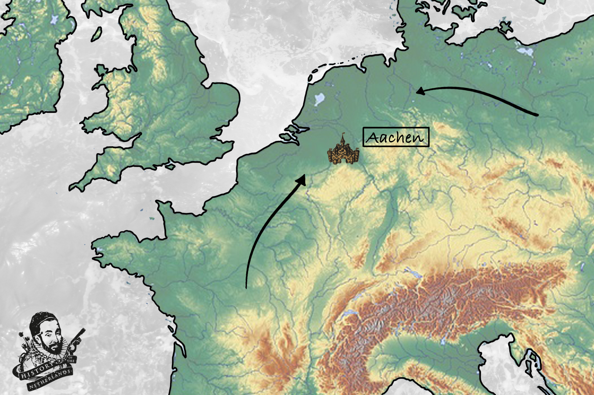

# Charles in Charge

In the latter half of the 8th century, events and circumstances around Europe become vastly influenced by a man who ruled a huge empire from his capital city of Aachen, just a stone’s throw away from the lowlands. This man is almost single-handedly responsible for the name Charles being as popular as it is today. But this Charles was, apparently, greater than the rest, and so he gets to be called Charlemagne in French, Karl der Große in German, Carlo Magno in Italian, Karel de Grote in Dutch, or simply just Charles the Great in English.

## Charlemagne’s Rise to Power

Charles Martel, the grandfather of Charlemagne and the Christianiser of the Frisians, had a son named Pepin. Pepin would finally cast off the facade of the ruling Merovingian dynasty that had emerged out of the Salian Franks. Pepin had the Merovingian king sent to a monastery, and became the king of the Franks himself - the first of what would become known as the Carolingian dynasty. Pepin, being a Frank, followed the custom of dividing his land and titles between his sons. When he died, his two sons Charles and Carloman had to share the entirety of the empire with each other. Tension would grow between the two brothers until Carloman conveniently died in 771 CE, with Charles becoming the sole ruler of his father’s kingdom. He immediately set out to expand it and, after winning some 50 battles, Charles managed to claim almost the entire mainland of modern day Europe, earning his epithet ‘the great’. His empire stretched from the Atlantic Ocean to the North Sea, and as far east as the Danube river. His was a territory inhabited by many different groups, loosely tied together under labels like ‘the Franks’, but separated by rivers, forests, coasts and mountains. Out of his loosely configured empire, he would create the feudal system, which would structure European political forces for centuries to come.

## The Vassal System

Charlemagne created a vassal system which needed constant oversight. He was well known for going around his empire and checking the loyalty and administrative capabilities of his subjects. Although his empire was massive, big plains stretched across it from the south-west to the north-east, across modern France and Germany, coming together in the lowlands. He therefore made his capital, Aachen, located right in between these two plains. Aachen and the southern lowlands thus became the centre of the so-called Carolingian Renaissance, where art and intellectual life began to flourish in the 9th century. The culture would have spread across those plains, as well as up and down the rivers. Stoked by the establishment of [Christianity](../cristianismo) as the empire’s religion, cathedrals, abbeys and convents were built and wealth began to be amassed by the Church.

|  |
| *The topography of Charlemagne’s empire. Note the location of the capital, Aachen, in relation to the lower areas.* |

## Warring Grandchildren

Charlemagne died in 814CE, leading to his son Louis the Pious taking over the empire. Louis later divided it into three parts, as was Frankish custom. His adult sons, Lothar, Louis the German and Charles the Bald, then began what would become a favourite family tradition of trying to kill each other in their attempts to become the sole ruler. After a period of civil war, the Treaty of Verdun split up Charlemagne’s former empire into three parts, known as East Francia, Middle Francia and West Francia.

## Viking Raids

It is impossible to look at the early Middle Ages in Western Europe without seeing effects of the Viking presence. Vikings came from Scandinavia in the north. Raiding down the coast, Vikings attacked Friesland and the areas that would become Holland, Zeeland and Flanders. But many Vikings also stayed, integrated into and ruled over those societies over time. The  best example of this in the lowlands is Rorik of Dorestad, who would become a part of the tangled web of politics that grew out of the devolution of Charlemagne’s empire. Another important figure was Godfrey Sea-King, would later achieve rule over Friesland by making a marriage alliance with one of Charlemagne’s grandchildren.

This was an era where power was gained through violence, diplomatic wiles and wealth, demonstrating that no matter how much things may change, some things always will stay the same. War, marriage and alliance systems were made to serve the individual prospects of the parties involved. If you conducted a violent act, but did it with enough wile, you could avoid judicial ramifications and position yourself quite highly within the vassalage system of the Carolingian empire.

Baldwin Iron Arm, a man with a fantastic name, kidnapped the daughter of the King of West Francia, and was rewarded with being enfeoffed the region of Flanders, so becoming its first Count. Here marked the arrival of one of the most influential regions of the medieval lowlands, and one that will be with us until we chisel out the modern country of the Netherlands in about 700 years time. The counts of Flanders will hold such sway over the following centuries that world history will hinge on decisions that they, alone, will make.

## Dissolution of Charlemagne’s Empire

For now, however, by the end of the 9th century Charlemagne’s empire was split into East Francia, West Francia, and the lands in between which would became known as Lotharingia. East Francia was essentially today’s Germany, West Francia today’s France, and Lotharingia contained in its northern half our humble, little lowlands.

From now on, the identity to emerge in the lowlands amongst individuals and groups will be impacted by the ebb and flow of power between the two larger states on its flanks - East and West Francia, France and Germany. 

