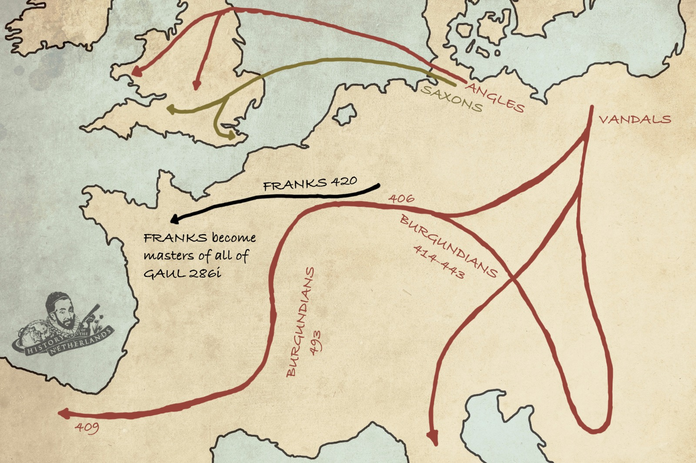

# Illuminating the Dark Ages

[Netherlands series](nl)

A common misperception is that once Roman influence ended in the west by 476 CE, the European continent fell into an abyss known as the dark ages, with very little of note happening until the Italian Renaissance in the the 14th century. Most historians today would most likely disagree with this notion, because many important and enlightening things were happening in Europe, including the lowlands.

Between the 3rd and 5th centuries, Roman control in the Netherlands fluctuated, until disappearing completely. Although taxes levied by Rome disappeared, so too did the benefits which being part of such a powerful empire brought, such as the infrastructure. The power vacuum left in the wake of the Romans created opportunities for new groups and individuals to step up. The struggle for domination between these different groups would have been near constant, except when one gained a degree of regional hegemony for certain periods.

Another large impact on the continent was the Great Migration, where different Germanic and Hunnic people began to move into the former Roman territories. The main groups moving into and around the lowlands were the Saxons and the Angles and they certainly had an influence on the Lowlands, especially Friesland. The Frisian name and sense of identity has sustained itself over a period of time when many names and people did not. Their name still exists to this day in Friesland, one of the twelve provinces of the Netherlands.

|  |
| *Germanic tribes spreading across Europe after Rome’s collapse* |

In the 4th century, Roman historian Eutropius, wrote of people called the Franks. They are believed to have originated out of various groupings of Germanic peoples living in the lower and middle Rhine region. They were not however a single, culturally or linguistically unified people. When another Roman historian, Ammianus Marcellinus, also wrote about the Franks, he was the first to mention a distinction amongst them as a cultural group. Specifically, he identified the Salian Franks, a dominant lowlander group who would leave a large mark on Europe. It is generally agreed that they were the founders of what would become the establishment of the Merovingian Frankish rule in Western Europe, taking guardianship of the transition from the classical age towards the medieval.

The Salians began their prominence in the 4th century. According to Ammianus, they established themselves in an area called Toxiandria, around where Zeeland and Flanders meet today. They were a loose confederacy with other lowlander tribes, centred around certain noble families thought to be descendants of the Norse god Wodan. The Franks held and identified with many different beliefs. The Germanic, Celtic and Gaelic spiritual beliefs originated from ancient Indo-European polytheistic paganism. Although these pagan roots were deep and firm, the seeds were sown for a massive cultural shift when Christianity began to appear on the scene in the 4th century.

[Christianity](../cristianismo) had already for centuries been through various degrees of oppression and acceptance in the old Roman Empire, but in 313 CE, the Edict of Milan decreed that Christianity would be tolerated, supposedly even inspiring Constantine to be the first Roman emperor to convert to the faith of Jesus Christ. Christianity went from being an underground movement to being protected by the state, contributing to its further spread. Servatius of Tongeren was an Arminian diplomat who would travel to and eventually settle around Maastricht, Limburg, becoming an early bishop and the builder of many churches.

In the 5th century Friesland, Brabant and Flanders kept getting invaded by the different Germanic tribes like the Saxons and Angles. A man named Childeric defeated many of these tribes and established a dynasty that would bear the name of his father, the Merovingian dynasty. His son Clovis, would later unite all of Gaul as a leader by the age of 15, and 5 years later, united all Frankish people, with the aim of subduing the Frisians in the north and all the Saxons in the north east. He  created Salic law, a code of civil law that would form the basis of Western European law into the middle ages. Clovis also converted to Christianity, making it the official religion, as it was the choice of the king. In time there would be the creation of different dioceses and much power was given to bishops. Merovingian tradition also led to the kings distributing their inheritance among their sons which lead to dilution of power, creating the establishment of lords and committees. Real power was held not so much by the king, but rather by dukes and counts, members of the kings court.

The Merovingians were the first ones to attempt spreading Christianity in the lowlands. They captured the fortress of Utrecht in 629 CE, built a church and intended to christianise the people around them, especially the Frisians. It wasn’t until Charles Martel, perhaps best known as being the grandfather of Charlemagne, that the Frisians would be somewhat subdued, and brought into line with the religion that would reign for the next thousand years. Since the fall of Rome, countless efforts had been made to fill the vacuum it left behind, with no one group achieving it completely. But one of most influential people in the course of European history, Charlemagne, would now stride onto centre-stage, to try and do just that.

<button onclick="window.scrollTo(0, 0);">Go to Top</button>
