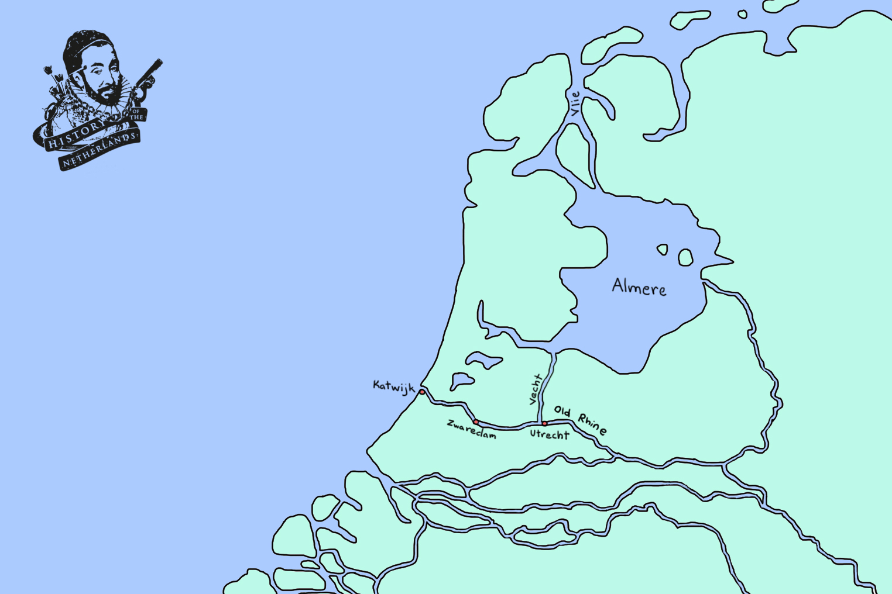

# Draining the Swamp

[Netherlands series](nl)

## Peat Moss / Sphagnum

Peat is the accumulated result of millennia worth of build up of fossilised organic compound. Importantly, there are two main groupings into which peat is categorised. Firstly, there are fens, which is peat that is exposed to mineralised and more alkaline groundwater, and therefore creates a lush, species-rich landscape, that can thrive off all of those minerals. The other, which in our area was much more abundant peat, is bog. It is fed only by rainwater, so is more acidic and less mineralised than fens, leading to less fertility. It’s pretty damn difficult stuff to get around in.

|  |
| *Peat moss* |

If you imagine a wet depression in the landscape, first there would be a layer of ground-water at the bottom of it, upon which fens would grow. Once the fens had grown high enough, it would become separated from the ground-water, at which point our current favourite thing, sphagnum, takes over. It grows up and out, filling and overflowing the depression in the landscape. What results are beautiful, rolling carpets of bog.

## Natural geography of the Netherlands

Before the turn of the millenium, the area roughly between modern-day Leiden, Utrecht and Haarlem, was dominated by the Oude-Rijn, the Vecht and the Spaarne rivers. When these rivers still flowed naturally, they carried sediments with them down from the mountains, creating broad sand and clay levees on their banks. As the flow upstream became clogged, the water level in these rivers dropped, exposing more clay, which was attractive for people to settle on. Clay flats might not sound attractive as a place to go and build a life, but if you’re living in a boggy swamp, options for parcels of land are not to be sneezed at. So before the year 1000, the few people who lived in this areas would have been in settlements close to the rivers, or along the high sandy dunes in the west near the coast. These dunes acted as large sand barriers protecting the land from the dangerous waters of the North Sea. The rest of the bog was basically empty wilderness. In the far north, in Friesland, there were also significant salt-marshes and mud-flats. Across the rest of the lowlands, vast forests protruded from the land.

|  |
| *What the landscape may have looked like before the great inundation of the All Saint’s Flood of 1170. Note that, prior to this catastrophic event, there was a big lake, called the Almere inland* |

## Draining the Swamp

The counts of Holland and Guelders, and the bishops of Utrecht, wanted people living on their lands, so from about 1050, began luring people to the area with promises of opportunity and relative freedoms. If you moved to the area and did the back-breaking work required to make it habitable, you would be granted your freedom and ownership of the land. From then on, all you would have to do is pay a small fee as recognition of the count as the overall lord of the territory.

|  |
| *Akkers in the Dutch landscape* |

The people would be allocated a block of land along a river or creek, and the right to reclaim the wilderness behind it out to a certain distance.  Bog is pretty awful stuff to walk around in, so in order to use their new land, they had to somehow drain the swamp. Literally. This is where everybody’s favourite fundamental force - the force of gravity - comes in. Water in rivers is constantly being pulled by gravity down the incline in the land, no matter how gentle that incline may be at some stages, from up in the mountains to down in the sea.

So, in order to drain the water away from these wet and soaring stacks of sphagnum, these colonists would have waded over the spongy surface, and cut large blocks of peat out of it, creating long, parallel ditches, which ran at ninety degrees down to the river. By puncturing the sponge, the water in the bog would then drain down those ditches, towards the river and from there to the sea.

The landscape thus created was one of long, skinny strips of land, called akkers, each belonging to a different family, all of the same length, as defined by the administration, with water at either side of them. The farmers could then happily farm their drier land, and the counts and bishops could make money by enacting tolls on the rivers, which the farmers needed to use in order to bring their goods to market; and then there were the taxes levied for participation in the markets themselves. There was another way that the counts and bishops benefited by enabling this common land ownership in their territories; all these extra farmers on the land provided more manpower for the armies needed for participation in the games of ‘whose army is bigger’ that the ruling nobility were always so caught up in.

## That sinking feeling

Through the increase of agriculture, the ditch-digging required to create the strips of farmland began a process of subsidence on the sphagnum surface of the north and west of the lowlands. The raised boggy peat started to shrink, as it drained out and oxygen set about rotting its insides. Furthermore, dried peat was a handy fuel, and so people for ages had very often also just farmed peat. They would continue to dig it up into lots, dry it out and cart it off to market. People would buy it and by burning it would heat their hearths and their homes.

As the increasingly populated lowlands bog slowly began to sink, the ground level slowly started moving closer to the surface water and everything gradually became wetter. Essentially, the giant, mossy peat soufflé that covered much of the lowlands began to transform into more of a terrestrial trifle. This process would not stop.

## Great floods

Subsequently, lowlanders in flood-prone areas found that sinking land and rising sea levels, over the course of the following centuries, could and would have devastating effects. Great floods, during which the North Sea would break through the dunes on the north-west coast, began in 1070. Each century and each generation thereafter would carry their own stories of the terror that the tides brought.  Five great floods are believed to have killed over 100,000 people, over the 12th, 13th and 14th centuries.

As a result, what these people needed to do was devise better ways; better technologies and systems for stopping and, eventually, controlling water. This meant the construction of ever-better dikes, dams, and sluices. These were projects which had to be coordinated not only between different people, but also different towns and even regions. The result was the establishment of waterboards, administrative bodies that would oversee the funding and realisation of hydraulic engineering projects. The leader, or chair of each waterboard was the dijkgraaf, or dike count. Given the importance of the waterboards’ function, this soon became an influential and potentially profitable position.

Through all of this, the processes of great migration, urbanisation and colonisation continued. People found other opportunities besides farming, since the floods had diminished the land available. Many little fishing villages had sprung up along what was now the coast, due to these floods. The relatively sheltered shores of what was called the Zuiderzee offered an ideal route for the people on the south of it to travel north, towards the towns of northern Germany and the Baltic Sea. Furthermore, towns along the Ijssel, the river which was now the main connection between the Rhine and the Zuiderzee, became more and more important as trading hubs.

The initial interferences with nature very nearly resulted in the lowlanders drowning themselves due to the never-ending chain-reaction of subsidence they accidentally began through draining the swamp, but by trial, error, and a lot of ingenuity, the people of the low countries successfully embarked on what must be the largest collective endeavour in not-drowning in human history.

|  |
| *After the great inundations it would have looked something like this. The Almere has now become a branch of the North Sea* |

More on this:

<iframe width="800" height="500" src="https://www.youtube.com/embed/jU4RlNbqDsc?si=ShpMALfqeWGIQM31" title="YouTube video player" frameborder="0" allow="accelerometer; autoplay; clipboard-write; encrypted-media; gyroscope; picture-in-picture; web-share" referrerpolicy="strict-origin-when-cross-origin" allowfullscreen></iframe>

<button onclick="window.scrollTo(0, 0);">Go to Top</button>
