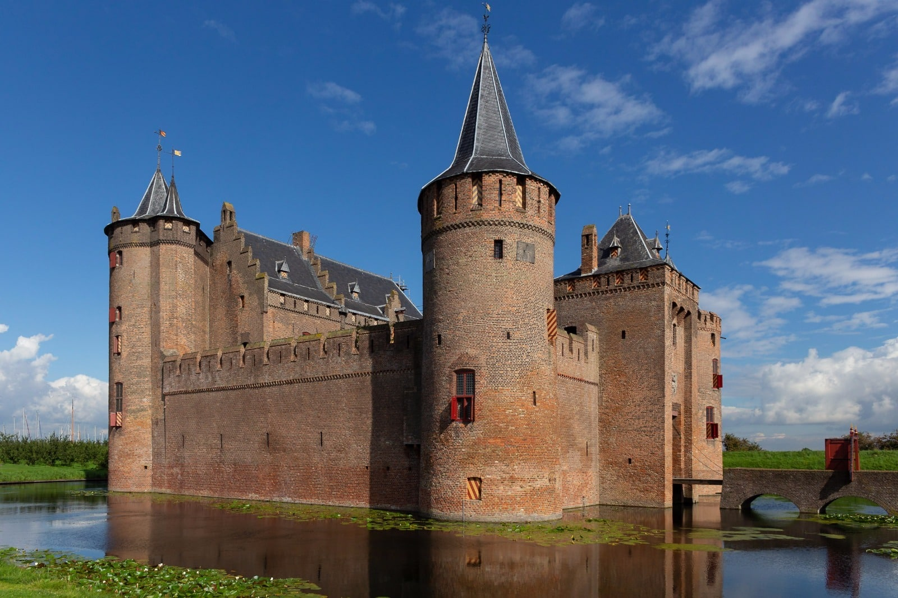
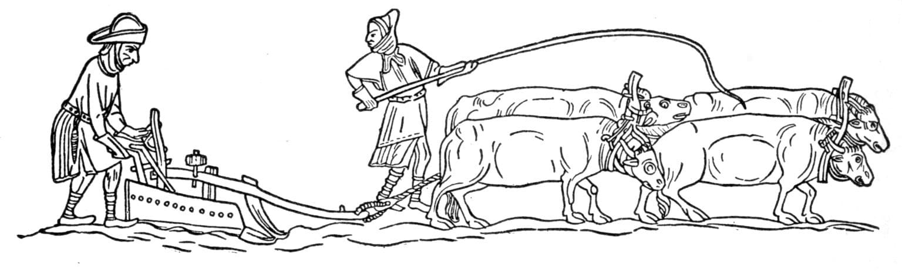
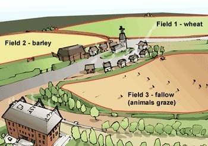

# Ploughin' Forward

Only a tiny minority of people who lived around the end of the first millennium of the Common Era would have been directly concerned with the conflicts with neighbours. For most people in the lowlands, it didn’t matter who their count or duke or emperor was. For them, life was nasty, brutish and short, and involved an overwhelming amount of backbreaking manual labour. But an agricultural revolution changed the life for these peasants forever.

## Church Developments

By the late 1000s the general idealism of what piety looked like had begun to change; a stricter sense of observance came to dominate the expected behaviour of the clergy, or at least the lower clergy. Monks and priests and nuns in this time came to practise celibacy, and no longer married. Wandering preachers abounded, and around them spiritual centres were built. Perhaps the most famous of these in the low countries is the Benedictine monastery at Affligem, which was started by six lay-monks in 1062. They had become followers of one such wanderer and it is the place from whence such great beer continues to flow to this day.

## Castles

Fortifications such as castles had been built as defensive measures, and ranks of lower nobility were put in charge of these by liege lords. These men were known as castellans. Given power over chunks of territory, as well as an awesome piece of machinery - a castle - these castellans ruled with absolutism in their local area and, in the process, often built abusive relationships with the local populations; exploiting them for servitude, their goods and their taxes. They could, without remonstrance, be pretty lax in their enforcement of the King’s law, if it benefited them to do so. Banditry, highway robbery, murder and theft abounded, and sometimes it was on the orders, or with the bought permission, of the castellans. Basically, there was little to no recourse for justice for the common folk.

|  |
| *Muiderslot in North Holland, the Netherlands* |

## Peace and Truce of God

By the 1020s, this non-Chrisian behaviour of the castellans came to clash with the rising confidence and social influence of the clergy, given their ever more entrenched high moral standing across all classes of society. A movement to establish what was known as the Peace and Truce of God sprung up, mainly in Flanders. This led to a religious revival, with many ordinary people participating in the erecting of new churches, as well as processions in which people, regardless of their rank, would walk barefoot behind images of the Virgin Mary.  The clergy used their presence, as well as anything at their disposal, like relics and bibles, to try and end disputes, even between armies. Apparently at the sight of a priest clutching a bible, people would suddenly forget what they were fighting about, and lay down their arms. They also tried to hold the abusive lower nobility, like castellans, to account for their exploitations of the people.

It was this first real flexing of its muscles in Western Europe which began to establish the church as a power base that would gradually break away from the direct influence of the upper nobility. 

## Bayeux tapestry

The Bayeux tapestry is an extremely detailed, large embroidery from the latter half of the 11th century. It provides a remarkable insight into everyday northwestern European life from the time when it was produced. Its main content shows the story of William, Duke of Normandy’s conflict with and defeat of Harald Godwinson, and his eventual crowning as the King of England.

If you look at the Bayeux tapestry closely, however, around the edges there are extra little scenes. The one we care about shows an age-old scene: beasts of burden dragging ploughs through a field, accompanied by the peasant farmers who worked the land. In regards to the history of the Netherlands, that is arguably the most important scene in the most famous medieval documentation of the time.

It was not a new scene when the Bayeux tapestry was created in the 1070s, as common people and animals had already been working land together for thousands of years. But what the Bayeux tapestry shows us is that, by the 1000s, the scene had undergone a dramatic transformation from those previous thousands of years. Prior to this time, the beasts of burden used by the people working the land had been oxen, and the ploughs had been light-weight. But in this scene, one of the beasts is a horse, and one of the pieces of machinery being used is a heavy wheeled plough. And those two things, - the use of horses and the use of heavy ploughs - for the people of the lowlands and, indeed for European history in general, would end up being a revolutionary combination indeed.

## Life of peasants

The common folk in the lowlands, very few of whom owned land, would either be serfs, attached by law to a particular estate, or free-folk who, nonetheless, had to enter into contracts of heavy obligation, farming land in order to have anywhere to live and grow food to feed themselves.

A village was, therefore, basically a settlement of several huts, depending on the amount of families, still built out of wattle and daub or whatever other material was available. On either side of the huts would be un-fenced paddocks or fields, which they had to farm. Produce would be taken to a central farmhouse, called a curtis, from which the workers and land was managed by those higher up in the pecking order.

In between these dotted habitations would be large manors, castles and estates controlled by a lower nobility, on behalf of their upper-noble liege lords, within the hierarchical vassal system of medieval European feudalism.

|  |
| *Reconstruction of an early medieval settlement near Utrecht in the Netherlands* |

This lower-nobility was referred to as the banal lordship. They were the local rulers to whom the everyday people answered and they possessed what was called bannum, which was basically the legal right to tell other people what to do; to summon people to court and to hand out justice.

## New farming revolution

The great social shift that was happening came about mainly because of a change in farming, and specifically in how to plough. Ploughing soil requires breaking it and turning it. Until now the common plough, used for millennia around the old Roman Empire, had been the scratch-plough, a fairly lightweight construction otherwise known as an ard.

At some point, however, the heavy, wheeled plough, known as a carruca, began to be used in this region. How it arrived in the low countries is totally uncertain and a matter of debate. The heavy wheeled plough has three important components: a coulter, which cuts the soil about 20cm deep, followed by an asymmetrical ploughshare, and a mouldboard. These last two turn the dirt from the side, bringing deeper soil to the surface. This whole get-up would be supported on wheels, instead of runner as the traditional ard was, meaning it did not get stuck in the dense soil as easily.

It required bigger, stronger animals than oxen to pull, so farmers began to use horses. Horses, however, require more food than oxen do. This was solved with other agricultural developments, such as the adoption of a three-field system, and incorporation of legumes in grown crops. Whereas the south European method of farming had involved a two crop rotation system - planting one field and leaving another fallow, and then swapping each year, the three-field system was a much better and more productive idea.

|  |
| *Medieval four-ox-team plough, redrawn from the Luttrell Psalter, an illuminated manuscript of c. 1330* |

The common, working folk began ploughing three separate fields, instead of two. In the first field they would grow cereal goods like wheats, grains and oats. Meanwhile the second field was left until autumn, when winter produce like rye could be planted, but also legumes: beans, peas and lentils. The third would be left fallow, left to rot, and the domestic animals could graze on the chaff.

|  |
| *Diagram of a three-field agriculture system* |

Bumper crops eventuated. With big yields of oat and grain, there was now enough fodder to feed the horses, who could now almost fully replace oxen in pulling the heavy ploughs over bigger distances, which could then be turned into tri-rotating crops, which could produce bigger yields. Furthermore, this could all be done with less manpower.

The excess of manpower and the surplus of goods left a whole lot of people with not much to do, and little chance of making a living. Those people had to go somewhere and do something, which leads to the phenomenon of urbanisation in the lowlands.
