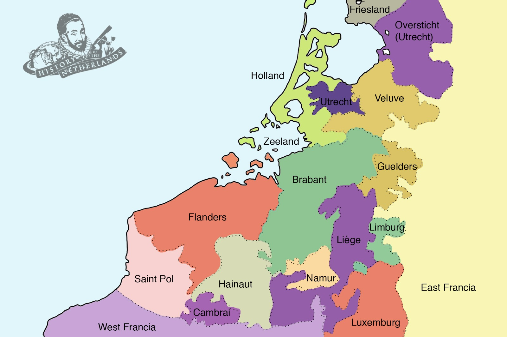
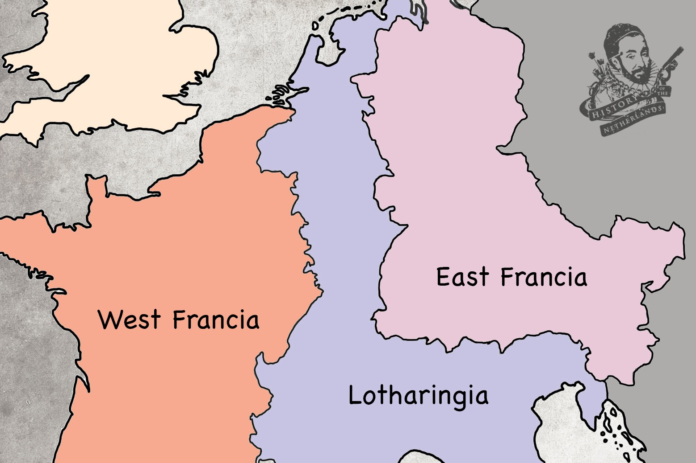

# Welcome to Family Feudalism

[Netherlands series](nl)

The disintegration of Charlemagne’s empire at the end of the 9th century left the lowlands part of a larger entity, Lotharingia, wedged between two much more powerful kingdoms, East and West Francia. If you were an ambitious noble, controlling one of the many small, swampy territories and you wished to move yourself up into a more prominent position, what would you do? Well, what lots of them chose to do was switch allegiances to and from between the great powers on either side whenever they deemed it politically necessary and beneficial to do so. Welcome to Family Feudalism!

## The role of the church

The church was playing an ever more important role in social life, however at this time it was also being ravaged by a couple of centuries of intermittent viking raids, of which abbeys and churches were often primary targets. Whilst many left their roles in the church, taking their families to flee from viking-risk zones, still others continued to move out from monastic orders around Europe to become missionaries.

The missionaries who went out into the lowland wilderness were still dealing with a populace only a couple of generations away from their ancient, entrenched paganism. Many would have secretly still maintained the beliefs and practices of their ancestors. Lowlander missionaries concentrated on things like ensuring the baptism of everybody, constructing churches, monasteries and abbeys, as well as generally just reaching out and preaching to locals. They were trying to win hearts and minds, so to speak.

## Lowland power games

In the medieval era the rights of a feudal nobility in Europe became entrenched in the social zeitgeist. The idea that there was a ruling class was not doubted, and the vast majority of people, the commoners, still had to and still did pay homage to the recognised rights of that nobility.

Power in the lowlands was a game played between members of this nobility and was always at the mercy of those who ruled the Eastern (German) and Western (French) domains. The local lowlander nobility therefore often switched their allegiance to and fro between those sovereigns, who themselves sought to place individuals loyal to them in positions of lowlander power.

Given that they were pretty much all related to each other, this was essentially an ongoing game of family squabbling.

|  |
| *The different provinces in the Low Lands* |

The first big rebellion of lowlander counts was led by one Reginar Long-Neck. In 910, under his influence, nobles of Lotharingia decided to shift allegiance from the east to the west and to elect the French King, Charles the Simple, as their ruler. He was perceived as weak, which is no doubt why those ambitious nobles of Lotharingia chose to switch to his side, wishing to exploit him in their attempts to grab more power for themselves.

Following the death of Reginar Long Neck, his son Gislebert became Duke of Lotharingia. Gislebert must have been something of a political chameleon, because he seemed to change colours whenever it suited him, switching sides between France and Germany no fewer than four times according to some sources.

Less than ten years after this old switcheroo, The Duke of Saxony, a man named Henry the Fowler, whose lands comprised pretty much everything to the east of the lowlands, was able to gather enough power to be elected the king of East Francia. Not long after, he convinced Gislebert (via battle) to once again get back in the Eastern corner that was Team Empire, and sealed the switch by letting him marry his daughter, Gerberga.

When Henry died and his son Otto succeeded him in 936, Gislebert went, once again, for the French connection, and pledged his allegiance to the now West Francian king, Louis IV. This completely annoyed the pants off Otto who marched his army into the lowlands and inflicted a case of death by drowning on Gislebert, once more bringing the lowlands into the suzerainty of East Francia.

Otto and Gerberga's younger brother, Henry, then took over as Duke of Lotharingia and it became, finally and for centuries more, the 5th stem Duchy of East Francia.

If you’ve found yourself getting confused by all these ridiculous 10th century names, and by the fact that all these people who are ruling and rebelling and marrying and killing each other seem to all be related, then don’t worry. Their names really were stupid, and they really were all related to each other.

|  |
| *The Low Countries at the north of Lotharingia, wedged between two powerful rivals* |

## Church re-invigoration

By the turn of the 800s into the 900s the Church in Western Europe was not in a position of strength. There was a general economic depression and as abbeys required land that was granted by the privilege of the nobility, they were dependent on these highly political and feuding creatures who were supposed to be running the whole joint. Often, nobles ravaged and exploited these places just as badly as vikings.

Bishops, however, came to wield great power. They could also be warriors and lead armies. Although the great rulers of France and Germany could not technically appoint them, it did not stop them using their influence to have those loyal to them put into ecclesiastical positions of power

In 910 the Cluny Abbey was founded in southern Lotharingia and was able to establish itself as independent; this would become the most famous and influential medieval monastery in western Europe, and that influence would certainly come to bear on the lowlands. Its abbot answered only to the Pope, and so a revived western monasticism was able to develop relatively free from the demands of the nobility, and was rather able to push back against them and their incessant wielding of power.

Cluny was a Benedictine abbey, which invoked a humble, frugal and pious form of monasticism. As these humble, frugal and pious monks wandered down toward the lowlands, they built rural churches and abbeys and their piety drew the citizens of society. Not only to attend church and hear these monks speak, but also to be provided with a group of solitary but exemplary men who would make you feel guilty because you weren’t as pious as they were. Guilt was a burden that could be shared by commoner and noble alike.

In the lowlands, particularly in present day Belgium, the spread of what would be known as the Cluniac Reforms was greatly assisted by the work of the Gerard de Brogne. He was of noble rank and had been a warrior, but turned towards Benedictine monasticism, returning home to build a church on his family’s estate. He then spent four decades reorganising, reinvigorating and rebuilding the Church in what is today Belgium.

Socially, this reform allowed for the establishment of the clergy as dependable authorities which the people saw as infallible and trustworthy. During the 900s, as the great nobles played their tumultuous games of stabby-stab-stab and ‘this is my castle now, buddy’, the church became a consistent force in the everyday lives of the common citizens, regardless of whether or not their liege lords’ shifting allegiances made them pawns for the French King, or for the Emperor.

## The nascency of Holland

In around 922 a piece of land was granted in the area that was variously known as West-Frisia, or Kennemerland, to a count who had been striving to maintain a hold on power against unruly Frisians to the north and north-east. His name was Dirk, and on the land he received he founded a nunnery, which would become a monastery that espoused the values of the Cluny Benedictine reforms.

Dirk and his descendants would become known as the Counts of Holland, although the area would remain known as West Frisia for a while longer.

## The Duchy of Lower Lorraine

By 958 the internecine wranglings between the higher nobility in the Netherlands led to a decision being made by another of Henry the Fowler’s children, Bruno the Great. He was, handily, both the archbishop of the very powerful diocese of Cologne, but also the brother of Otto, who was by now King of Germany. He was a perfect example of the German kings using their influence to gain power within Church structures and over Church domains.

Bruno was given the lay title Duke of Lotharingia. But after yet another revolt, this time by a grandson of Reginar Long Neck, called, wait for it, Reginar III, Count of Hainault, Bruno decided that Lorraine was pretty ungovernable and split it into two smaller, easier to control regions, Upper and Lower Lorraine. Lower Lorraine encompassed basically all of today’s Netherlands, including Friesland, as well as a vast chunk of eastern and central Belgium, Luxembourg and a part of the German Rhine valley. Only the County of Flanders was still loyal to the French King.

Bruno's heavy handedness once more inspired the nobles of the lowlands to raise an impertinent middle finger in the air, and throw the region into tumult again. They just did not like being told what to do.

## The Rise of Flanders and its many Baldwins

We know that the counts of Flanders had a penchant for the name Baldwin, taken from the first of them, [Baldwin Iron-Arm](charles#viking-raids), who was around in the 800s.

Baldwin Iron Arm had become the first Margrave or count of Flanders by running off and eloping with the daughter of the French King, Charles the Bald, in the 860s. From that early point Flanders was a vassal of France, as opposed to the other lowland fiefdoms which were, as we have seen, extremely unhappy vassals of the Emperor. The Flemish counts had a significant influence in the matters of France and the French throne.

The couple’s son, Baldwin II, had come to power in Flanders in 879. Not longer after, he moved his power base north, and built fortifications at Bruges, Kortrijk, Gent and Saint-Omer, all of which would become places due to leave indelible impressions on European history.

Despite Flanders owing allegiance to the French throne, the position of French king was so often embroiled in the political machinations of the French nobility, and often was not strong enough to have much influence over the Counts of Flanders.

So, relatively independent, Flanders just rocked along, consistently gaining wealth and power.

Coming into the 1000s, the Count of Flanders, surprisingly called Baldwin IV, went about acquiring more territory for himself. He had a magnificent beard, earning himself the epithet ‘the Bearded’.

Meanwhile, another duchy, Normandy, had grown in strength, and so Baldwin looked deeper into the lowlands to expand his influence, at those fiefdoms which owed allegiance to the empire and were not too happy about that. Baldwin the Bearded jumped in on the side of the nobles, and went about pushing north and eastward. The empire fought back, and even created a coalition against him that included the King of France and the Duke of Normandy. This succeeded for a short while but only a few years later, he once more brought his military resources into the lowlands. The Emperor tried to fortify against his expansionist aims, but did not have the support of the local nobility.

Baldwin the Bearded managed to do enough to be enfeoffed by the Emperor with Alost, to his east, and Zeeland, to his north. There now existed two separate Flanders, all ruled by Baldwin the Bearded; his original holding of French Flanders, and the new Imperial Flanders. This made him incredibly powerful. Although he was a vassal of both sovereigns - the French king and the Emperor - this meant he could wield great resources and influence against and over them. William of Poitiers, the influential priest and chaplain of the Duke of Normandy, wrote of Baldwin:

“The kings feared and respected him; dukes, marquises, bishops trembled before him.”

Power in western Europe had once more flowed into the lowlands. The bearded one would die in 1035, leaving his son, the last Baldwin we will mention for the moment, Baldwin the V, as the very powerful Count of Flanders.

He went to war again against the Emperor, in which he did not fare so well, losing land to Herman, Count of Mons and Hainault. Although Baldwin V lost land to him, when Herman died, Baldwin married off his son, whose name you can guess but we promised not to mention again, to the widow of the dead count. Because women didn’t really have any rights, this effectively put his family in charge of Hainault, which was one of the most powerful fiefdoms in the lowlands.

This was a terrible deal for the Empire, but, showing how influential the count of Flanders was, he still managed to get the marriage acknowledged in a treaty by the Emperor. He was set.

## Flanders and the Invasion of England

Baldwin V made some savvy political moves. In 1053, his daughter, Matilda of Flanders, was married to the young Duke of Normandy, William the Bastard.

In 1060, the French king died, leaving his 7 year old son the throne. Baldwin V was then made co-regent of France, along with the child’s mother, Anne of Kiev. He also married the dead French king’s daughter, Adela. The count of Flanders was, arguably, the most powerful noble in western Europe at this time.

When William decided to invade England, Baldwin helped his son-in-law by providing men and arms which proved crucial to the famously successful and world-changing Norman take-over of England.

This was a huge investment for Baldwin. He had an unusual position, but one that truly reflected the vagaries the political of his times. Stuck between France and Germany, dealing with the whims and wishes of those lands’ sovereigns, lowlander politics had to be about securing this tenuous position, while not being sucked in or absorbed by one of the larger neighbours. The nobles in the Imperial lowlands fought for this against the Emperor, and the counts of Flanders, obliged to the French kings, positioned themselves against losing their identity to France.

Baldwin could have likely put a stop to William the Bastard’s transition into William the Conqueror, had he so wished. The count of Flanders was now pretty much in charge of France, and it was in no way in France’s interest to have one of its vassals go and take over England and all of its resources. But Baldwin deemed that it was in the best interests of Flanders. He actively facilitated this world-changing event. From this point, this constant ebbing and flowing of power across this north-western swampy part of Europe would not only include the sovereigns of France and Germany, but England would also gradually come into the fray, creating another potential rival or ally, which would leave a lasting impression on the history of the Netherlands.

<button onclick="window.scrollTo(0, 0);">Go to Top</button>
