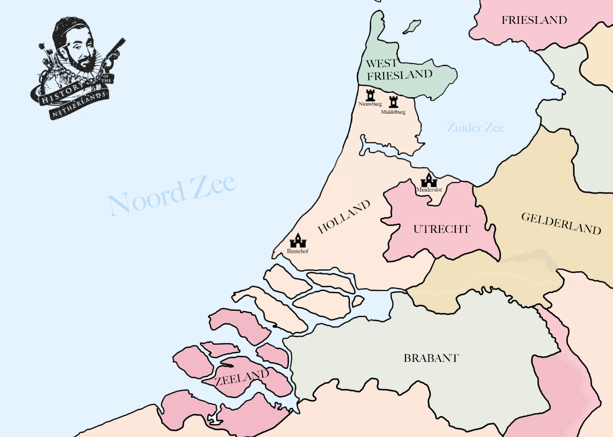

# The Murder of Floris V

Our attention moves on how the area which, after various disastrous floods cut it off from Friesland proper during the 13th century, became known as West-Friesland, and which would by the end of that century be conquered and subdued by the warlords of the House of Holland. We’re going to cover anti-kings, people falling through ice, a son’s revenge of his father’s murder, peasant uprisings, backstabbing nobles, kidnappings and mob violence.

## William II - Buried in Frisian Ice

When a crisis over the Holy Roman imperial throne erupted in the 1200s, the young Count of Holland, William II, was proclaimed as the new King of the Romans in 1246.

This was exciting stuff for William, and he celebrated by making himself the Count of Zeeland as well. This was a handy little trick, as Holland and Flanders were continually in dispute over Zeeland, but now as Emperor he could do what he wanted.

The Countess of Flanders, Margaret, disagreed stiffly, and sent an army, led by her sons, Guy and John, to make battle over the issue in 1253. William’s brother promptly went and defeated them, and put Guy and John in prison for three years on behalf of the Count of Holland.

William had issues in the north, particularly in the area known as West-Friesland. He had a burning desire which was pretty common amongst the Counts of Holland to subjugate the West Frisians and bring the whole region under their heel. So William went about doing just this. His first attempt was soured by too much mud, so he waited until winter when the boggy ground had frozen more solid, and took his army north. He then split it in two, in an effort to going about encircling the West Frisians. But the West Frisians refused to meet in open battle, and just continually harangued the armies, both of which found that ice was not that great to march across.

At some point William went with a small retinue to chase the main body of rebels, but his haste was greater than his men. He found himself alone, on his horse, hunting his enemy. But alas, the ice was not his friend. His horse broke through and he fell under. The West Frisians who were watching him from afar came screaming out, pulled him out of the ice, and promptly killed him. The Dutch king of the Romans was dead.

The West Frisians, when they became aware of just how high a noble they had slaughtered, got extremely concerned about what the consequences might be. So they buried William II’s remains under some random house, and shut up about it. That, for now, was that.

## Floris V

Upon the death of William II in 1256, his son, Floris V, became the Count of Holland and Zeeland. Like his father before him, when William was thrust into this new position, he was not experienced at leadership, military strategy or life in general, given that he was only 2 years old. His mother, Elizabeth of Brunswick-Lueneberg remained to look after him, but his guardianship went to his Uncle, also called Floris. This was the same man who had successfully defeated the Flemish over the issue of Zeeland, in 1253. As the guardian of his comital nephew, he became creatively known as ‘Floris the Guardian'.

He ruled as his nephew’s guardian until he was mortally injured in a tournament in Antwerp in 1258. Thereafter, responsibility for the young Count of Holland went to the Duke of Brabant, Henry IV. Henry IV was one of those rulers who got the short straw in the hereditary gene stake. Presumably all the years of noble inbreeding had had an impact, and he was seen as ‘infirm of both body and mind.’ He was deposed in 1257 and the governorship of Holland became a disputed matter, with Floris V still not of age. His aunt, Adelaide of Holland, became regent in 1258, and got support from some quarters of the ruling elite of Holland, whilst other nobles, barons and lords threw their weight behind the Count of Guelders, Otto II. As we know, disputes such as this in the middle ages, if they could not be solved by a pithy marriage here and a trade-concession there, would best find resolution in a spot of bloody battle. The two sides met at Reimerswaal in January, 1263, from which Otto prevailed. He would be the regent of Holland until Floris V was considered old enough to rule, which by the way was only 12, in 1266.

## Peasant Uprising in Holland

In 1274, Holland got caught up in the same kind of social unrest we spoke about in the last episode when disgruntled peasant farmers in Kennemerland revolted against the local nobility. They went on a rampage through western Holland, pulling down castles and manor homes and forcing the nobility of that area to hide behind the walls of the town of Haarlem. People from the surrounding areas, such as Waterland, Amsterlandt joined in the revolt, and a group of ambitious nobles from the borderlands between Holland and Utrecht, led by one Gijsbrecht van Amstel and his brother-in-law Herman van Woerden, decided to side with these peasants against the young count.

This was another case of lesser nobles hoping to climb the ladder of chaos to a higher position for themselves. Gijsbrecht van Amstel had already been a thorn in the side of the bishop of Utrecht, John of Nassau, for a few years. John had been forced to give him a castle at Vredelandt due his own terrible financial position and now, bolstered by this army of peasants, he marched to the walls of Utrecht itself. Once there, one of these Kennemers apparently made a rousing speech, which incited members of the guilds of Utrecht to sympathize with their cause, throw out the nobles and magistrates of the city and join with their cause.

|  |
| *The situation in the lowlands* |

Floris V was, however, was not as green as he was cabbage-looking. Realising that the pressure point lay in the shaky alliance between commoners and the lower-nobility, he began to give concessions to the commoners. By doing so, he brought them back around to his side. These concessions were designed to placate a railing mob. He evened up the rights between farmers in dunes and farmers in polders and granted privileges to different towns, also as a compensation for the damages they had incurred during the conflict. That is how, in 1275, the people from a small town that had built up around a dam on the river Amstel were given the right to not pay tolls on goods they moved through the waters of the county of Holland. Thus for the first time in the written record do we read of a town called Amestelledamme, or as it would later be known, Amsterdam. The town that would go on to become the financial and commercial hub of a vast trading empire was first built on a tax break, go figure. In 1278, Gijsbrecht van Amstel and Herman van Woerden were captured by Floris and the rebellion was over.

In the aftermath of these uprisings, the weak Bishop of Utrecht, John of Nassau, agreed to hand over the lands of those rebellious lords, which he had in theory been the ruler of, to Floris as compensation for his assistance in putting an end to it. Holland was, as a result, larger by the end of this series of events, considerably at the expense of Utrecht.

## Oh to be the King of the Scots

When the king of Scotland, Alexander III, died in 1286, his only successor was a 9 year old girl from Norway. Even though she got on the ship to go and take her crown, the ship never arrived. Thus the inheritance of the Scottish throne was up for grabs. Floris’ great grandmother was a great aunt of the dead Alexander III, so he made a claim. Although receiving some support from the king of England, in the end Floris V was denied, which must have irked him somewhat.

## Flanders, France & Flo’s Foreign Policy

Much of lowlander politics at the time was influenced by the inheritance conflict between the Avesnes family and the Dampierres. They were both from the same origin, but the Avesnes had been granted Hainault, and the Dampierres Flanders in the 1240s. Since then they had been trying to encircle one another through marriage and war. The House of Holland was with the Avesnes, and firmly against the Dampierres, even despite the fact that Floris married a Dampierre.

At the same time the importance of English wool, which had its staple port in Dordrecht, Holland, meant that Floris went about forming a decent relationship with the king of England, Edward I. He affianced his daughter to the English crown prince, and although the early death of that prince brought an end to such a grand scheme, it showed that he had his sights set high.

But the English king had his sights set higher, and set about trying to build a system of alliance against the French king. He did not care about who was Avesnes and who was Dampierre, and slowly he brought Brabant and Flanders into his alliance with Holland. Floris, however, could not abide losing the stapel port at Dordrecht, and having to ally with the hated Dampierre’s of Flanders. The relationship between England and Holland severely soured.

## The murder of Floris V

The consequences were immediate and dire. Soon a conspiracy was hatched to kidnap the count and sneak him off to England, to whatever fate awaited him. The same counts who had rebelled against him in the 1270s, Gijsbrecht van Amstel and Herman van Woerden, were part of the plot. On a hawking trip, they led him into an ambush where, despite what we imagine to have been a defiant struggle against them, he was overpowered and tied up, before being carried to Muiderslot castle where his assailants considered their next move.

However Floris had become a champion amongst the common class, following his progressive and liberal reforms to their benefit. Men from Kennemerland, Waterland and Amstelland all set out looking for him. As a result, his kidnappers attempted to move him from the castle towards a more secure location. This, however, was their downfall, as men from Naarden caught up with them. During the ensuing chase, the horse the count was tied to stumbled, and he fell off. Gerard van Velsen, who had orchestrated the kidnapping, went into a panic and ended up stabbing Floris 21 times. He then fled. When the men from Naarden found the count, he was breathing his last.

After 42 years rule, Floris left the world having overseen the transformation of Holland. It had expanded in size and population; had seen massive infrastructural projects undertaken; he had given out rights to peasants and urban commoners, even earning the nickname ‘The God of the Peasants’. He attached his name to what would become the oldest document known to mention Amsterdam, the city which would go on to become the most influential in all of the low countries. He also did what no other count of Holland had done: mercilessly subdued the Frisians, during which he avenged his father’s murder and found his lost remains. To boot, he also attempted to become the king of Scotland on the way.  Most importantly, after William and Floris, Holland had now become a serious player on the chessboard of the low countries.

Floris was succeeded by his son John, but he died at 15, leaving no heirs. Thus did the noble House of Holland disappear. In their stead, the county of Holland, would pass on to the Avesnes family, with Floris the Fifth’s cousin John of Avenes, becoming the new Count. The Avesnes had come out of all of this in a pretty secure spot. They were now the counts of Holland & West Friesland, Zeeland and Hainault, a powerful union of counties that would last for the next fifty years.

## Poem about Floris V, from Edward Grimestone’s Generall Historie of the Netherlands,  (1615)

*In just revenge of fathers death thou spild'st the blood*

*Of Frisons, that had him destroid, and thee withstood:*

*And having taken his bodie from the place where't lay,*

*Intombedst it in Middleburgh, from whence thou took'st thy way*

*To Flanders, to abate their pride, that quietly*

*Gave thee their princesse for thy spouse, and for her dower

*Whole Flanders: but when thou to hunt in woods wast gone,*

*Thy foes thee slue, when thou hadst rul'd full fortie yeares and one.*
