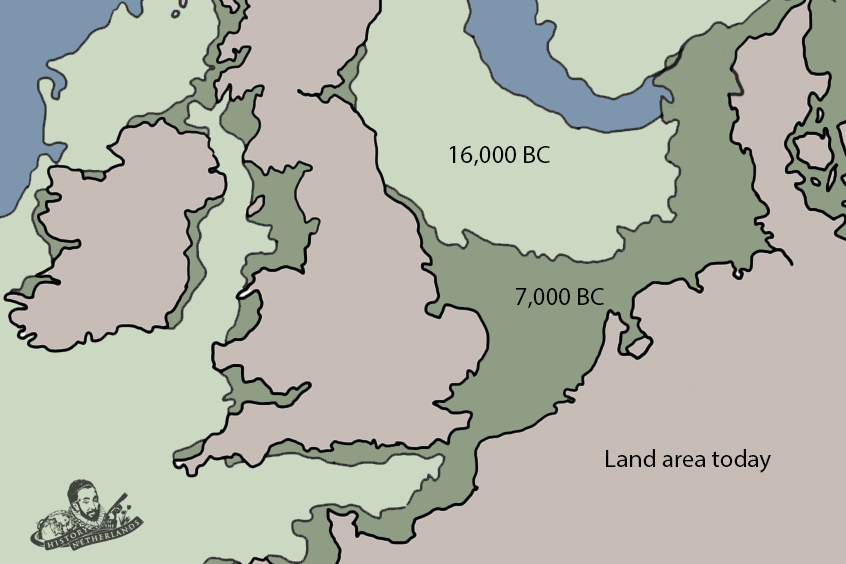

# The Ice Age

The biggest and most enduring major geographical event to shape the lowlands happened between 250k and 130k BCE, during the Pleistocene Epoch. During this period of glaciation, large parts of the region were covered in ice, which made a large impact on the land beneath it. The glaciers created hills in the north and the south of what would, thousands of years later, become the border between the Netherlands and Germany. Valleys emerged, which would eventually enable rivers to run from the higher lands in the south to feed into what is now the North Sea.

|  |
| *The expanse of the glacial tundra that covered all of north-western Europe, and its decrease over time* |

Archeological evidence has been found from the early stages of this period. Discoveries of flint-tools in different parts of the lowlands, around 250,000 years old, suggest that nomadic hunter gatherers roamed around. But, likely because of the difficulties of living on a giant slab of ice, it seems that people abandoned the area during this period and humans did not return until some 100,000 years later, around 37000 BCE.

It was at the end of the Pleistocene Epoch, at around 11,700 BCE, that the geography of Northern Europe slowly began its transition to what is recognizable today. By 4,000 BCE, the North Sea had been formed, replacing what had just been an icy tundra that was so large that one could have walked from Denmark to Ireland.

The first major migration would eventually come from Central Europe, starting perhaps around 7000 years ago. In this migration, the hunter-gatherer societies were introduced to the tenets of the neolithic revolution. New people brought new ideas; farming knowledge like animal husbandry and other technologies evolved and spread westward through millennia of life and migration. Celts settled in the hills of the south while the ‘Vlaardinger’ civilization settled more along the coast. Influence from Scandinavia fed into the north of the Netherlands, as exemplified by the discoveries of funnel lid shaped pottery consistent across Northern Europe. In the Netherlands, these have been found in stone tombs, called dolmen, or Hunebedden.

From around 6,000 BCE, people in the region were transitioning themselves towards a so-called ‘Bronze Age’, and then, subsequently, an ‘Iron Age’ by around 750 BCE. Iron was a widely available resource in the lowlands. Bog iron could be extracted from the prevalent peat land. Several excavations have been made but the most notable is a grave known as the King’s Grave. Found in today’s town of Oss, the tomb, believed to be constructed between 2000 and 700 BCE, stored iron artifacts, such as this absolutely useless, curved, iron sword.

The abundance of ore in the lowlands is thought to have led to increased prosperity for those involved in its manufacture and trade, with skilled iron smiths travelling from village to village, producing tools and weapons upon demand. The wealthier aristocracy that had slowly evolved, would provide income for these tradesmen, leading urban centres to grow.

The different people and cultures living around in the lowlands varied, but those who lived in exposed areas along the coast and the rivers shared one common element of life, the threat of flooding. It took communal effort of people to build flood controls and develop technology to protect themselves. As we like to argue, the lowlanders began the world’s greatest and most enduring collective exercise of not drowning. Water management would become a constant theme to Dutch history that continues to this day. The land they occupied had to be taken, reclaimed and borrowed from the sea and the rivers. This could never be a solo effort, but had to be a communal one.

Around 700 BCE, people settled in Friesland in the fertile floodplains of the north-west, around what would become known first as Lake Flevo, and much later as the Zuiderzee. In this area people began to build terps, a human built mound, sometimes up to 15m high, upon which one or several settlements were built. These were designed to situate living quarters higher than tide-level. People also built canals to redirect water as well as rudimentary dikes, made up of stacked peat slabs. The people living on the terps would not live relaxed lives however, as they had to till the land, plant seeds and deal with different harvests. These were fertile lands due to the sedimentary deposits made by the rivers and the sea, and so were worth farming, despite the risk.

Around 500 BCE, the Batavians arrive down the Rhine river, settling in an area known as the Betuwe, between the great Rhine and Meuse rivers. The legacy left by the Batavians towards the development of a later Dutch identity, was one that would last longer than any, except perhaps the Frisians. At around 300 BCE, the northern coastal dunes of the Netherlands were settled by the Cannanefates, and the land south by the tribes of the Belgae.

One of the earliest references to the people living on the floodplains comes from a Greek explorer named Pytheas of Massalia. He made a voyage of discovery in around 320 BCE, circumnavigating Britain and reaching up in into the Baltics. Of the lowlands, he said: ‘more people died in the struggle against water than in the struggle against men”.

This piece of history serves a constant reminder that the geological processes of the lowlands shaped not only the physical land, but also the minds of the people, societies and cultures that emerged upon it. In learning how to protect themselves from flooding, the early lowlanders set a precedent for generations to come. It would take two millennia for their control to reach a level of mastery, but the social principles of meeting that need would remain.

At its core, the struggle against water created an ever present understanding in lowlander cultures of the need for cooperation. Over time this would grow towards localised identities that demanded the community to work together against flooding. This collective defence mentality would, over the next 2,500 years, become a strong cultural undercurrent for the people of the European lowlands.

2 major takeways from this early history:
(1) How the cultural impression of living in flood risk lands would fortify the people of the lowlands for years to come;
(2) how the people who inhabit these wet, peaty lands dealt with their various, much bigger and generally more powerful neighbours. From early on, and forever more, the people of this swamp needed to learn how to adapt not only to the vagaries of the rivers and the sea, but to the political and cultural heavyweights that it will always be surrounded by. This is clear when we look at the impact made on the lowlands by the rise and domination of the [Romans](../Romans).
