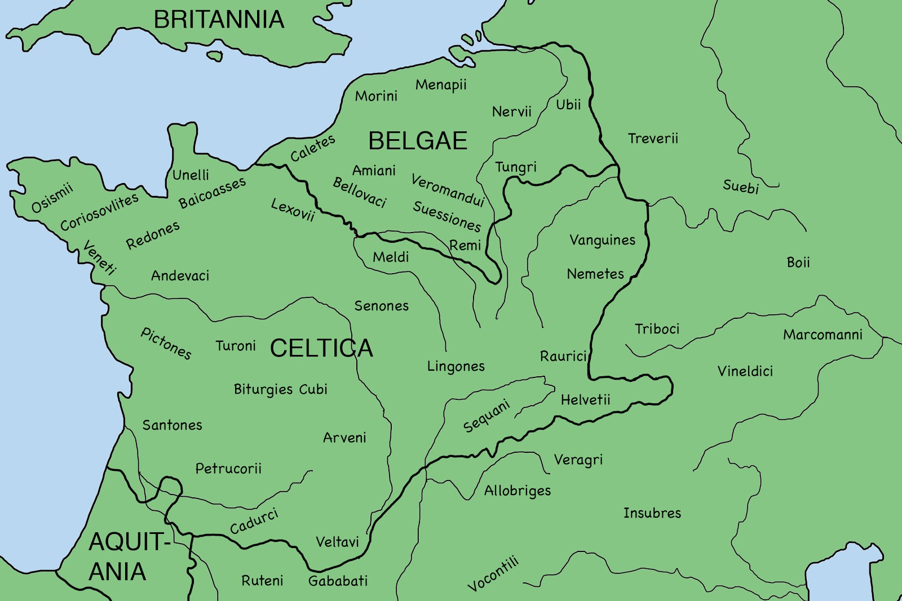
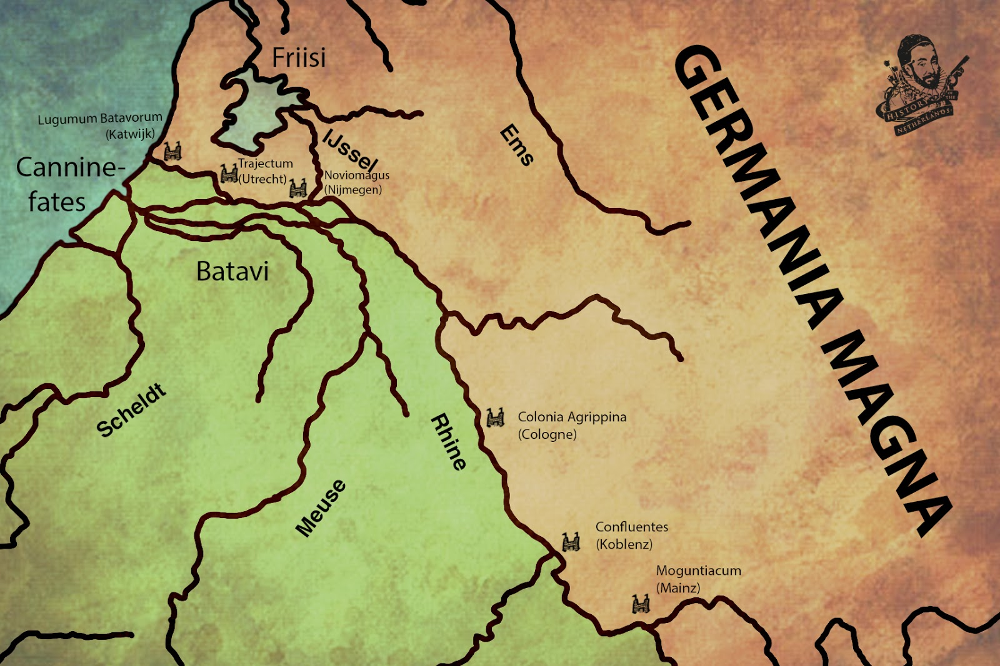

# What have the Romans ever done for us?

Throughout history, the Low Countries would often be defined by their interactions with great powers nearby. This began when those in charge of the original European superpower, Rome, decided that the border of the empire would be the Rhine river, running right through the heart of our beloved swamp. One lowlander tribe, the Batavians, would learn the hard way that when you find yourself, your land and your people are now “in Rome”, it’s better to just do as the Romans do.

Rivers were, and still are, very important to the development of society. Rivers carry boats, and boats carry people. People drive the movement of goods and wealth. In the ancient past, ships on rivers required safe harbour, providing incentive for towns to develop, charging tolls in exchange for this. As people went from port to port, via rivers, carrying goods, they also carried news, knowledge and ideas, which would be exchanged with others along the way. Taverns and inns played an important role for diffusion of knowledge, much like the way the internet does today.

From the mountains of Switzerland, the Rhine River starts its long, descent through modern day France, Germany, and Luxembourg before finally seeping across the Netherlands and pouring out into the North Sea. Father Rhine, as it is commonly called in various parts, is a life giving source, upon whose banks many different societies and cultures have come into being. Although the Rhine has always fulfilled the riverine functions we mentioned earlier, it has also played another, important role. It has been a border, used to stop the movement of people.

The Rhine hosts many influential cities, such as Basel, Cologne, Bonn and Utrecht. The reason these places developed where they did is because of the defensive nature of the river. The Rhine was the border between the Roman world and the barbarian lands to the North and East.

Around 50 BCE, the Roman republic was the superpower around the Mediterranean. They had most likely been in contact with lowlander culture through trade on the Rhine river. Ancient Roman pottery has been found in Friesland for example which implies it was carried there by that river.

In 58 BCE, Julius Caesar commenced what would become eight years fighting wars of conquest and enslavement of people known as the Gauls. It is difficult to pinpoint who these Gauls were as in Rome’s opinion, ‘Gaul’ meant pretty much everything in today’s France, lowlands as well as much of Germany. Caesar divided Gaul into three parts, Belgica, Celtica and Aquitania.

|  |
| *Map of the different tribes in Europee* |

Caesar did identify the different tribes that made up the people of Gaul but with a major distinction. People living on the inside of the Rhine were what he called Germani Cisrhenani, and people living on the other side were Germani Transrhenana.

But Caesar was looking at the world from a Roman point of perspective, as a prospect for exploitation. During the Gallic Conquests he built alliances, made deals, broke deals and manipulated various peoples against each other, then wrote about it to sell his achievements to a Roman audience. Though the Rhine might have been a natural border between Rome and the Barbarians, the people making up Gaul were very much ingrained with each other as they had been trading and sharing between their cultures for a long time. Although in this ancient period of the Lowlands, we refer to certain people and tribes, it is a simplification needed to be made as we lack any real information about who these people actually were, hence using labels given them by other people like Julius Caesar.

By 12 CE, Emperor Augustus decided the Roman border had to expand beyond the Rhine, as far north as the river Elbe. The military commander Nero Claudius Drusus was sent to expand those borders, and the various Germanic tribes had to make a choice between submission to Rome or defiance against its legions. The Roman historian Cassius Dio tells us about how one tribe, the Sugambri, defied Rome, so Claudius Drusus, according to Cassius:

|*Devastated much country*

Cassius also mentions another tribe, the Frisians. He said that Drusus:

|*... sailed down the Rhine to the ocean, won over the Frisians, and crossing the lake, invaded the country of the Chauci, where he ran into danger, as his ships were left high and dry by the ebb of the ocean. He was saved on this occasion by the Frisians, who had joined his expedition with their infantry*

|  |
| *Map of the Lowlands during the Roman Empire* |

The people of Friesland would at first comply to the Roman rule but as more taxes were put on them they would eventually expel the Romans from their territories, leading a Roman army to confront the Fries at Bedehenna Wood. In the ensuing battle, over a thousand Roman soldiers were killed. This result led to the people of Friesland remaining free from Rome for the following 20 years.

Other tribes such as the Cenanefates and the Batavians, also had to deal with the might of Rome. Tacitus wrote this about the Batavians:

|*The Batavians are the bravest race of all the Rhine country. They occupy an island in the river, and a small strip along its banks. Once they were a branch of the Chatti, but in consequence of a domestic quarrel they removed to their present position to become a part of the Roman empire. They enjoy that honour still, and likewise a special privilege that marks their old alliance with us. No tribute brands them as inferiors ; no tax-farmer spoils their substance ; excused from all tax or contribution, they form a reserve of brave men, to be employed only on the field of battle, like a magazine of arms kept in store for use in war*

The Batavians were so good on the battlefield that they were given an unusual exemption from the taxes often put on the people obliged to Rome. Instead of money, they would only have to provide soldiers. It has been suggested that the Batavians provided more of their people to the Roman army per capita than any other tribe. At a young age, their boys were taken away and put into service. The elite fighters of the Batavians became so admired that in 30 CE, a personal bodyguard for the Emperor was formed, called the Numerus Batavorum, formed only by Batavians. Over time it would change, but under Emperor Vitellius in 69 CE it would intensify as now both boys and men were conscripted. Tacitus writes:

|*Batavians of military age were being conscripted on the instructions of Vitellius. The levy was by its nature a heavy burden, but it was rendered still more oppressive by the greed and profligacy of the recruiting sergeants, who called up the old and unfit in order to exact a bribe for their release, while young, good-looking lads — for children are normally quite tall among the Batavians— were dragged off to gratify their lust. This caused bitter resentment, and the ringleaders of revolt got together and succeeded in inducing their countrymen to refuse service*

Not only was the population disproportionately recruited into the army, Roman officers were holding hostage and ransoming the elderly and young alike, as well as kidnapping and raping Batavian boys. This led to a revolt with Gaius Julius Civilis emerging as leader, claiming to be the descendant of Batavian kings. He managed to convince almost all the Batavians to rally behind him, and his revolt brought in other local tribes such as the Tungrians, who inhabited what is today in the east of Belgium. The revolt culminated in a single battle with two Roman legions. Civilis used a tactic widely employed amongst ‘barbarians’ that Rome fought, where women would position themselves behind the lines, and shout encouragement to the men fighting, or cry grievously if any of the men looked like retreating from the fight. As Tacitus put it, the women and children were there: ‘as a spur to victory or a reproach to the routed.’

Civilis would defeat the Roman army of 6500 men, expelling the Roman forces from their lands and pursuing Batavian autonomy. Although the Batavians would eventually be defeated and incorporated back into the Roman empire, over the next centuries cracks in the stability of Roman power in the region only continued to widen. Germanic tribes would continue do what Germanic tribes did: move, reproduce, fight, move some more and reproduce a little bit more.

As the Western Roman Empire started completely crumbling in the 400s CE, the influence of Roman institutions, trade and culture over the lowlands, Gaul, Belage and Germania disappeared. With the Roman collapse a void would be filled by different people, emerging out of the lowlands, called the Salian Franks. They will come to dominate the erroneously named ‘Dark Ages’.
