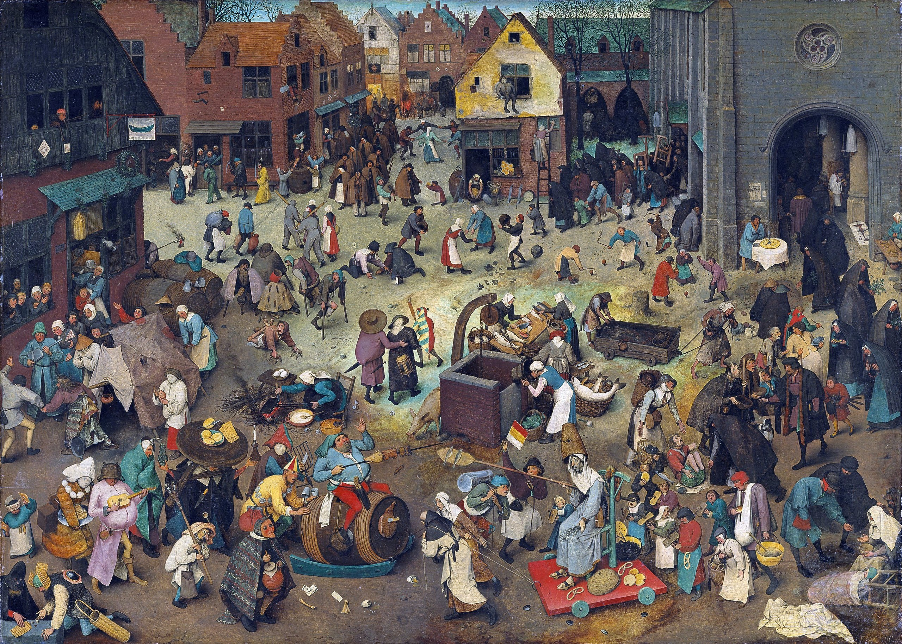
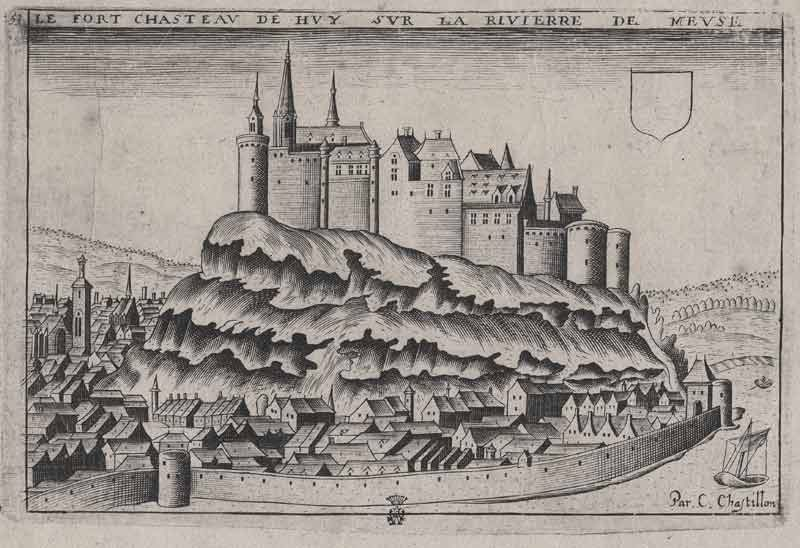
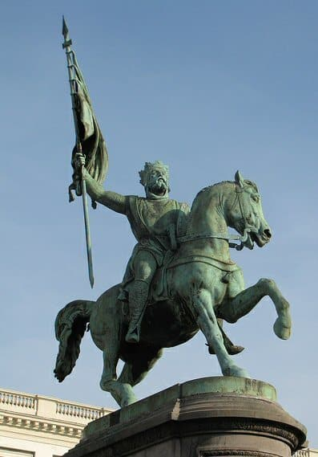
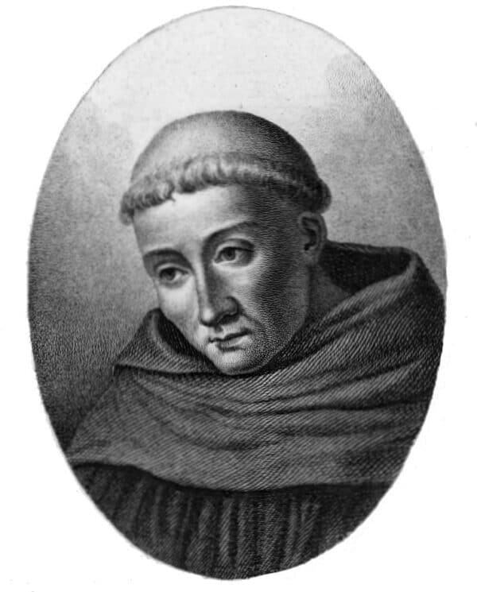
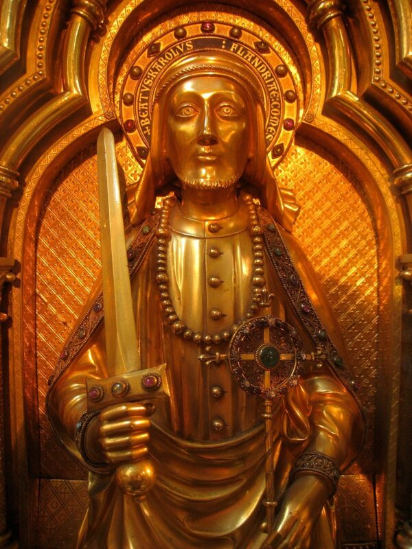
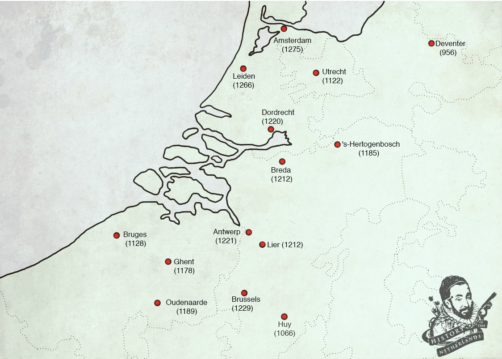

# Getting Down in Town

Freed from the need to be working the land due to the improvements in agriculture, people in the Low Countries began congregating in urban centres. For the first time, members of the common class were able to put their fingers onto the scales of power, and begin to balance it back in their favour by making city charters. But the creation of a new body politic in the 11th century would not be without its adversaries, nor without its consequences.

## Leaving the countryside and clearing forests

With the surplus of labour created by the improvements in farming technology, many people took their skills and knowledge and moved away from the countryside to places where they could sell them. That meant that people began congregating in towns, where they could put their skills to industry, and from which merchants could take them to marketplaces. Often towns would pop up around existing castles, or abbeys and convents. Specialists would often group together, so certain towns became famous for, among other things, their cloth, brewing, or pottery.

There were also many people who left their farms not to move to towns, but rather to reclaim land from the forests which covered the southern lowlands. In the last half of the 11th century, the land clearances which had already been happening since the 800s took on a more systematic nature and agricultural intensity ramped up in former forested areas. Peasants took opportunities by large landowners to go and create new fields that could be worked. Production of pigs, sheep and cows skyrocketed.

|  |
| *Pieter Bruegel the Elder, The Battle Between Carnival and Lent, 1559* |

## The creation of new communes

Although other cities existed around Europe, these were often centres of ecclesiastical or monarchical power. What made many of these new towns in Flanders unique, however, was that they did not have established, central, administrative structures working on behalf of a sovereign. It’s tempting to say that their development had something organic about it. The people who flocked to each other had likely had to convince or defy their liege lord to let them go and seek opportunity elsewhere. From the start, in the growth of these settlements into towns, and then into cities, there seems to have been a rebelliousness and striving for something that smelled a bit like independence. That smell would not only linger but grow, especially as the amount of wealth in towns grew.

>What made many of these new towns in Flanders unique, was that they did not have established, central, administrative structures working on behalf of a sovereign.

Commercial endeavour paid great dividends. Merchants who had become rich could stop having to travel themselves, instead hiring others whilst they themselves stayed put in the towns. They could even buy land. These patricians became a class unto themselves, the nouveau riche, forming a base of power within these growing urban centres that relied not on bloodline or family name, but on having a bucket-load of money and commercial influence. Merchants in cities had common vested interests, so could eventually pool their wealth and influence together for all of their mutual benefit. Now, the liege lords had to reckon with the fact that new power bases, apart from themselves, were becoming established.

## New sense of identity

Towns were full of individuals who had gone there to build lives, to get work, and to build families and futures. This created a sense of citizenry, as town inhabitants became attached to a common identity that was along the lines of ‘I belong to this town’. This was even more pronounced over generational time-spans, once people were being born in, and growing up in the towns.

It also created a market economy on which the increasingly powerful mercantile class depended. People were getting rich off the growth of these towns, and so it was in their interests to have all these people living, eating, buying, making and selling things. It was in their interests to protect the rights of those living in the towns, and to cast off the arbitrary justice of their lord’s whim.

What you then had was nobles who needed money, and large groups of people with money, who wanted freedoms, which only the nobles could give.

## Granting of town charters

So, simply put, the ruling nobility started to sell privileges to people in towns. The oldest record of this is the city of Huy, on the river Meuse, within the domains of the bishop of Liege. It drew metalworkers and became renowned for that industry. But Huy also drew spinners and weavers and winemakers. In 1066 it was granted rights by the bishop, such as permission to build city walls, for instance. It has been noted that this charter was heavy on the rights of landlords to reclaim runaway serfs. It also resolved, however, that the landlords had to be able to prove the status of the serfs. So here for the first time, the rights of people living in towns began to be wrested from the hands of their liege lords.

|  |
| *The town of Huy, as drawn c. 1600 by Claude Chastillon, bears the first record of city rights granted in the lowlands. This image provides a clear example of how these towns would develop. The castle, built originally in the 9th C, provides a focal point for commerce and authority, while the city walls provide protection, and help to establish a sense of independent identity.* |

## The impact of the crusades

The great culmination of the Church’s integration within all levels of Western European society was the onset of the Crusades, which started in the 1090s. Following Pope Urban II’s rallying cry for true Christians to go and help the Byzantine Emperor take Jerusalem back from the Seljuk Turks, various groups began to mobilise. Surprisingly, some of the first and most celebrated emerged out of the lowlands. Peter the Hermit infamously led the people’s crusade, which was composed mainly of commoners, and which set off before the first, organised military crusade.

|  |
| *Godfrey of Bouillon (c.1060-1100), duke of Lower Lorraine and a leader of the First Crusade. He became the first Latin ruler in Palestine after the capture of Jerusalem from the Muslims in July 1099* |

The so-called ‘First Crusade’, which followed the people’s crusades, was a great, militarised mobilisation of princely forces from around Christendom. It consisted of four armies, including one led by Godfrey of Bouillon, the Duke of Lower Lorraine ie, the lowlands. He rallied the counts, dukes and other princes around the lowlands, entreating them all to join their forces and head off to take back Jerusalem. Some, such as the Count of Mons and Hainaut, agreed. Others, such as Dirk II the Count of Holland, did not. The Crusades thus created gaps in the existing power structures of the nobility, which the towns, with their rising sense of independence, strove to fill.

## The 12th Century Renaissance

In 1115, a Cistercian monk called Bernard founded an abbey at Clairvaux and went about building immense influence within the Catholic hierarchy. He undertook two journeys into the lowlands and founded Cistercian abbeys there. He would also be the main figure to preach the Second Crusade and, when it ended in absolute failure, was the one who bore the weight of blame for it. The Cistercian movement was strengthened through the actions of another monk, called Norbert of Xanten, from the Rhineland. He too founded monasteries in the lowlands and, together with Bernard, became so influential as to be attendant within the court of the Emperor when he was in the lowlands.

Bernard and Norbert, and other Cistercians, taught that ancient texts could give specific and exact rules, and not just guidelines, for how one could be the best monk possible, and how wholesome, Christian communities could function. This promoted the intensified gathering, reading and interpreting of as many texts as possible right at the moment when returning crusaders were bringing back so much ancient material which had been begged, borrowed or stolen from the Islamic world. This time period would become known as the 12th Century Renaissance.

|  |
| *Cistercian monk and mystic Bernard of Clairvaux (1090-1153) was founder and abbot of the abbey of Clairvaux and one of the most influential churchmen of his time* |

So, as well as urbanisation causing the rise of a patrician class within towns and the first big ruptures of absolute feudalism in Europe, there was a general promotion of learning that only served to increase self-empowerment.

## The murder of Charles the Good

The city of Lille, in 1127, was ruled by the Count of Flanders and Hainaut. One day, that count, whose name was Charles, rode into the city to reclaim a runaway serf, but was chased off by the locals, who had armed themselves against him. Apparently, some among the Count’s retinue were even beaten up and thrown into the swamp. The Count soon returned with his forces and besieged Lille, forcing the citizens to pay fourteen hundred marks of silver. Although they had been put down by the Count, the town citizens had clearly been emboldened by their new found collective strength, and were willing to stand up to their rulers.

|  |
| *Charles the Good (c. 1084-1127) on his reliquary in the Saint-Salvator Cathedral in Bruges* |

Early the next year, Charles was involved in another incident which demonstrated how the fragile relationship between the towns and the old nobility could easily disintegrate, when he was murdered after trying to have an influential family known as the Erembalds recognised as his serfs. Charles’ murder caused much outrage amongst all classes. Immediately upon his death, he was portrayed as a benevolent and kind ruler, and was given the appellation Charles the Good. The shocking event of Charles’ murder was talked about around Europe and chronicled by Galbert of Bruges.

## Adjusting to the new reality

Some lords saw that prosperous cities could actually be beneficial to themselves in different ways: politically, militarily and economically. Ruling lords had rights and needed money, and towns had money and needed rights. So they began to make trade-offs, and use the growing commercial power of the towns to their benefit, trading privileges for taxes.

Charles the Good died without issue and so the question of his succession sparked a civil war that would end in the Count of Alsace, Philip, becoming the new count of Flanders. He is a fine example of an upper noble, adjusting to the intellectualism of the 12th-century renaissance and to the change in social structure taking place with urbanisation.

He started granting privileges to the wealthiest, most productive towns of Flanders. In 1170, he then took a leaf out of the codified law book of ancient Rome – a hot topic within the discussions and writings happening at the time – and came up with a Great Charter. This codified the laws governing those towns: Bruges, Ghent, Lille, Arras, Douai, Ypres and St Omer. So with uniform law, and beginning to acquire privileges, these towns were on their way to gaining city rights.

|  |
| *Dates that towns were granted city rights* |

## City rights

City rights included the permission to build a wall; having a marketplace; having their own court and trials; having the right to charge tolls; the right to levy taxes and to mint coins. Once accumulated these all made the towns stronger, able to regulate the commerce within their boundaries and to be of benefit to the count’s ability to get taxes for himself.

In terms of how our modern world has developed, town citizens gaining the right to be tried according to reason, by a town jury, rather than face the arbitrary judgment of the nobility, is perhaps the most important development of this era. Gaining some level of control of judicial processes within the town, having the means to regulate the marketplace and acquiring rights for citizens of towns to defend themselves and make decisions for themselves are components that define modern societies today. Before this time, the feudal system had forced most people to be stuck in bondage, tied to the land and totally deprived of any kind of political rights. With the rise of towns during this period of urbanization, non-noble people were for the first time able to put their fingers onto the scales of power, and at least begin to balance it in their favour.
