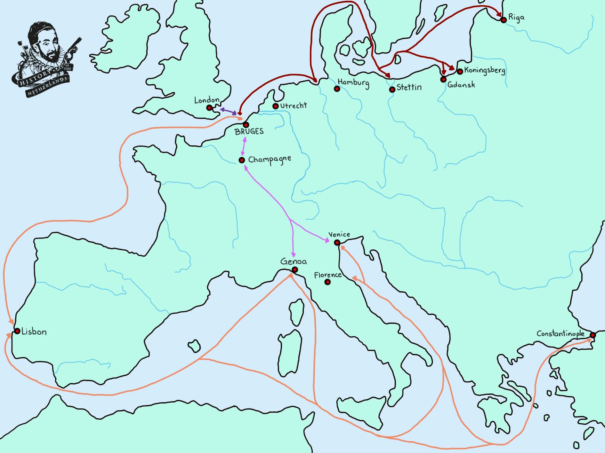
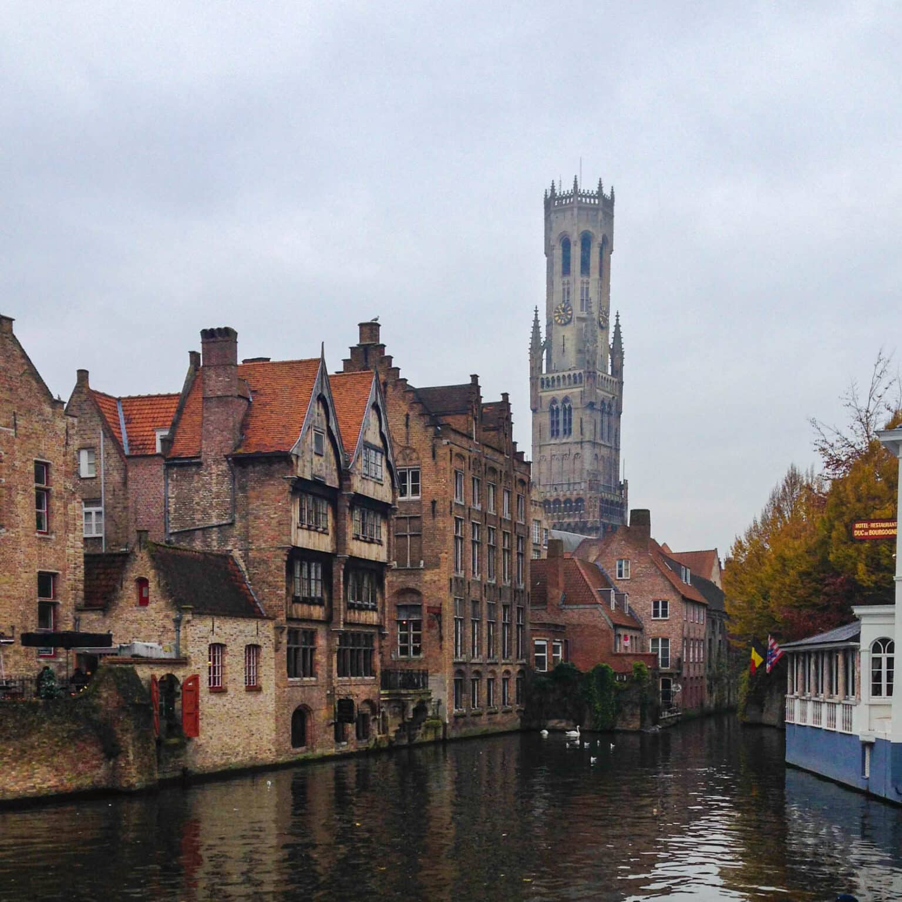

# Wool Trade Left Its Mark on Power and Architecture in Medieval Flanders

[Netherlands series](nl)

First, you are shorn off the sheep’s back. The wool comes in a variety of textures, a gradient from coarse to fine, and fibres differing in length. Even wool from the same sheep can differ. So after you’re shorn off, you and your diverse woollen friends are sorted by coarseness – varying qualities being destined for different destinations and textile purposes. You are passed between manual labourers. The shearers, packers and cart-drivers are commoners, who will take any job they can get. You are then packed up and carted off to a nearby marketplace, or even straight on a ship to be taken directly to the destination where pretty much all wool in this part of Europe is taken: to one of the cloth-making towns of Flanders.

Here, more unskilled labourers unpack you and begin the cleaning process, using a chemical bath to take away oils and grease. After this comes the beating, where you are strung up and hit with willow branches, removing residual foreign matter and disentangling remaining knots. You really enjoy the beating, you dirty wool, you. At this stage, you may be dyed for the first time. If so, you have become ‘dyed in the wool’ – so to speak – where preliminary colouration is achieved, most often by use of woad, a plant whose extract turns things blue, or madder, which produces rosy red. Blue woad is the more common, however, and leaves the most lasting impression. Those who work as dyers are often identified by their blue hands for this reason.

|  |
| *A medieval depiction of women spinning and carding wool, while Queen Tanaquil of Rome operates her loom. Scenes such as this would have been common around Flanders at the time.* |

Carders use devices called, unsurprisingly, cards, which are flat boards with hooks in them, by which the carder can properly separate strands of wool and even blend in other types of wool – sometimes of a different colour – for various effects to appear in the end product. All of the steps in this process are necessary, but carding takes specific knowledge and skill. When it is finished, you are tightly wound on a forked stick, called a distaff. This is to be handed over to the next group of workers, the spinners.

Spinners take you, newly carded wool, tightly wrapped around a distaff, and then use their skilled fingers and a drop-spindle, and spin your fibres into yarn. Here we see the beginning of the final stages in this whole process. After being spun, there is an opportunity for you to be dyed again, if you haven’t been already. Following this, you can now be woven from yarn into cloth.

>By the 11th century the vertical loom had been replaced by the horizontal loom, which was more efficient

Weaving takes skill and knowledge in using a loom. By the 11th century the vertical loom, which had been used for millennia, had been replaced by the horizontal loom, which was more efficient. This technological development was perhaps the most important in the growth of the industrialised, medieval textile industry. The weavers set about using their different types of threads – called warps and wefts for the weaving enthusiasts out there – to turn you, now yarn, into variously textured and coloured cloth.

After being woven, the fullers would have a go at you. Fulling is a pretty disgusting job that involves you being soaked in a chemical bath of hot water, a type of clay called Fuller’s Earth, and urine. This removes any lingering grease. This is all to make you perfect, remember. Fulling is amongst the least respected but necessary jobs. After soaking you, the fuller will then hit you with a hammer or, if you are a particularly fine cloth, stomp you with their fuller’s feet.

<iframe width="560" height="315" src="https://www.youtube.com/embed/cdJVqPQXG9I?si=kguumpkE4DlibG9f" title="YouTube video player" frameborder="0" allow="accelerometer; autoplay; clipboard-write; encrypted-media; gyroscope; picture-in-picture; web-share" referrerpolicy="strict-origin-when-cross-origin" allowfullscreen></iframe>

Each town has its own regulations and requirements of quality that will be enforced via these public inspections, determined by the governing body of the urban elite. Fulled fabrics at this stage can still have a fuzziness to them, and so another skill – called shearing – will be conducted, whereby this fuzz is removed. If you as a piece of fabric are to be truly soft, however, this will happen in conjunction with the process of napping, whereby you will be rubbed softly with a certain prickly plant, by which you can be made to be luxuriously soft. You may undergo any degree of repeat shearing and napping, depending on desired outcomes. You may then be dyed, for either the first, second or third time, before being smoothed between a flat, wooden vice.

And now, finally, here you are, at the end of this entire process. You are ready to be folded up, soft and smooth to the touch, and packed off to a market, or sold directly to whoever will pay the right price for you. To end this train of thought, you can imagine now ending up in any variety of destinations.

>The patriciate provide a market for the most luxurious fabrics, whilst the nouveaux riches see fine fabrics as an expression of their own quality

By the 1200s, Flemish wool is renowned around Europe. The highest quality stuff is being shipped across the continent, to clothe the nobility and to drape their manors and palaces from Italy to England. The patriciate – the urban elite who govern the towns, also provide a market for the most luxurious fabrics, whilst the nouveaux riches – those emerging entrepreneurs who have new wealth but not so much political influence, see fine fabrics as an expression of their own quality. Lesser quality fabrics might end up in monasteries and cloisters, or more often in everyday households.

So any of these places could be your final destination. Starting as wool off a sheep’s back in northern Europe in the 13th century, you truly could end up anywhere, but probably not before going through one of these Flemish towns, and this whole process first.

## The emerging power of craft guilds

From the 12th century, guilds emerged around Europe. The first guilds to emerge in the low countries were merchant guilds, which had become the urban patriciate. With the rise in population and the importance of specialised workers due to the growth of industry, craft guilds came into existence. In Flanders, it has been suggested that they started as religious groups, where workers from specific trades united in Christian devotion and solidarity to each other and Jesus.

Craft guilds would be created for almost every type of profession; there would be guilds of blacksmiths, soapmakers, bakers, butchers etc. They would have a monopoly on their respective industries in the areas that they set up, so for example if you wanted to be a baker, you needed to become a member of the bakers guild of the town you were in. Guilds would have the task of controlling the quality of products produced, maintaining the stability of prices and fighting for the interests of their members. They had a strict hierarchy. At the pointy end were masters, below them journeymen and at the bottom were apprentices.

|  |
| *The Syndics of the Draper’s Guild in Amsterdam inspect the quality of cloth. Painting by Rembrandt van Rijn, 1662* |

Guilds operated along almost communistic lines in controlling the specific trades they governed. Guild administrations analysed what the market was doing, what the condition of supply was, and then decreed the work available to its members, as well as wages. The purchase of supplies was controlled by the guild, which disallowed any one person from cornering a market or buying up excessive quantities of whatever. It could be extremely restrictive, but the system would persevere and eventually come to define public structure.

For patricians – the urban elite who ran everything – the threat of guilds to their grip on power in towns would have become evident from fairly early on. The skilled craftsmen and low-level traders who all played necessary roles for the proper functioning of the ever lucrative cloth industry had no political representation but were now forming into bodies who could demand just such. As a result, the emergence of guilds was met with resistance by the patricians, who tried to curb the growth of the guilds’ political potential. If you were a member of this patrician elite, you wouldn’t want your profits being cut into just because a group of pesky workers thought they deserved more pay.

>Guilds would become a powerful force in the lowlands over the coming centuries

Because the urban elite controlled wages, dissent began to foment amongst the workers’ guilds by the mid-1200s. There is evidence in Flemish town ordinances emerging at this time prohibiting workers going on strike, as with Douai in 1245, and that were against the assembly and formation of societies amongst cloth workers, as with St Omer in 1250. These ordinances were passed by the respective town councils, comprised of the patriciate, in response to strikes amongst textile workers.

These measures were, unsurprisingly, not successful in preventing workers from showing their discontent. Textile workers in Ghent went on strike in 1252 and in 1274 again, along with the workers in Douai. 1280-81 saw a year of general strikes across Flanders; in Ghent, Ypres, St Omer, Bruges and other cities. In these strikes, workers were led by the nouveaux riches of the merchant class; the wealthy who were not amongst the patriciate. Guilds would become a powerful force in the lowlands over the coming centuries, and it is at this point that their journey towards political, social and cultural influence in the lowlands began.

## The rising importance of Bruges

The success of Flemish cloth had initially taken merchants from the cloth towns out of Flanders to places like England, from which almost all the raw wool used in the industry was acquired. By the late 13th century, Bruges had taken the lead position of 15 Flemish cloth towns in the Flemish Hanse of London. The Champagne region was extremely important, as Flemish merchants could sell their fine wares at extensive, annual trade fairs. There, lowlander merchants could connect to Italian merchants, who snapped up the famous Flemish cloth.

However, this also caused a backlash by merchants of these distant markets, who began themselves travelling to Bruges, where they could invest capital, set up shops where possible, and arrange the transport of cloth back to their home markets. Italian merchants were big on this game. Importantly for them, the Genoese and then the Venetians figured out the sea routes to Flanders through the straits of Gibraltar from 1277, and so the overland trade routes between Italy and Flanders, which met at the markets in Champagne, began to lose their prominence. That prominence was taken over by Bruges.

|  |
| *Trade routes to and from Bruges* |

The switch from overland trade to vast amounts of foreign merchants and foreign ships coming and going from Bruges by the end of the thirteenth century thus began to cut down the influence of the Flemish merchants themselves and with this loss of power their stranglehold on the labour market, and of quality control, was loosened and slowly taken over by guilds. In addition to foreign merchant organisations, such as the Hanseatic League, which set up offices in Bruges, foreign banking interests also descended upon the new capital of commerce.

|  |
| *The iconic belfry of Bruges* |

The two richest banking families in Western Europe, the Medicis from Florence and the Fuggers from Augsburg, both set up branches in Bruges, introducing serious investment capital and services for money exchange. The most important foreign partner for Bruges though, was by far England. England was the source of almost all of the wool used in the Flemish cloth towns and the economy of Flanders would be dependent on its availability.

The architecture of Bruges and other cloth towns began to reflect the new economic situation and power dynamics of the age. The most important location was the market square, around which huge new buildings were erected. This included a belfry, with great, chiming bells ringing out, telling people when to start working and when to stop, as well as calling people to gather when they were required in matters of civic justice. Waterhalls were constructed, in which ships’ cargo would be unloaded and stored to be sold at the market.

|  |
| *Labors of the Months: October, from a Flemish Book of Hours (Bruges), by Simon Bening (c. 1483/4-1561). Note the people walking in the treadwheel crane* |

Bruges famously had a giant, wooden, treadwheel crane that looked like the Sandcrawler used by the Jawas on Tattooine. The treadwheel crane would be powered by people walking in a kind of giant hamster wheel, which would provide the energy needed for the crane to lift goods and shift them around. It became a famous sight to behold for people visiting the city.

Guild houses were built, where the administration of the different guilds was carried out and where members would meet. The largest was the cloth hall, in which the overseas trade was arranged, funded by the wealth brought in by all these international visitors. The guildhalls were the centre of everything in town, like prototype town halls. Now, within the cultural framework of the lowlands, there were legitimately civic buildings; a place in the town centre which could be a focal point for the town’s identity, that was not a church nor a castle, but a reflection of the people and the business of the town.

<button onclick="window.scrollTo(0, 0);">Go to Top</button>
