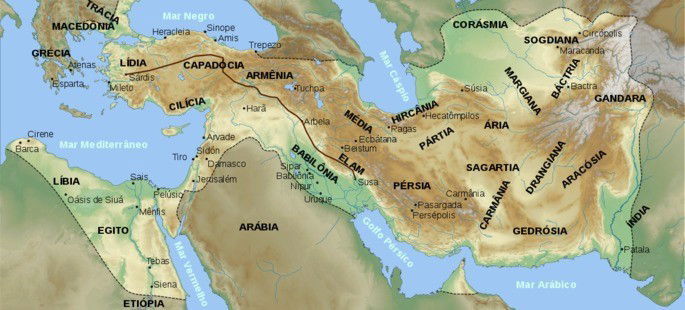

# Pérsia 

A Pérsia se localizava, principalmente, ao leste da Mesopotâmia, no atual território ocupado pelo Irã, que era chamado de Pérsia até 1935, quando mudou seu nome.

## Império Persa

Os persas se estenderam por um largo território. Dentre as suas conquistas destacamos: a Babilônia, o Egito, os Reinos da Lídia, Fenícia, Síria, Palestina e as regiões gregas da Ásia Menor.

Quem deu início ao Império Persa foi Ciro, o Grande (560 a.C – 529 a.C). Porém, o desenvolvimento da civilização se deve, principalmente a Dario I, o Grande.

Este foi o responsável por grandes construções, principalmente a Estrada Real, cujo objetivo era manter a hegemonia dos povos conquistados. Seguiu-se Dario I, Xerxes I, Artaxexes I até o último imperador, Dario III, derrotado por Alexandre, o Grande.

